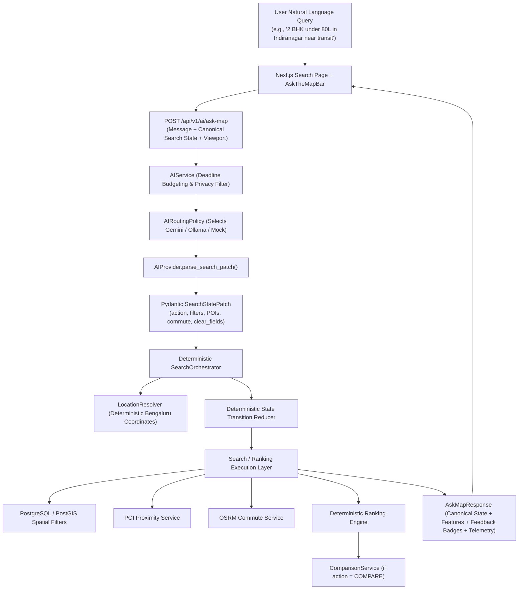

# Ask the Map — Conversational Property Discovery & Search Orchestration Architecture

## 1. Executive Summary & Architectural Principle

EstateMap's conversational discovery engine ("Ask the Map") enables users to explore, refine, rank, and compare properties using natural language directly against an interactive map interface.

The fundamental architectural principle is maintained strictly:

```text
The LLM interprets user intent into a validated delta patch.
The backend deterministic orchestrator decides and executes capabilities.
PostgreSQL/PostGIS owns all spatial, POI, commute, and ranking facts.
```

No vector databases, embeddings, autonomous agent loops, or LLM-generated SQL/code are used. All search operations resolve to deterministic PostGIS queries, POI proximity calculations, OSRM commute routing, and multi-factor ranking algorithms.

---

## 2. Core Components & Data Flow



---

## 3. Canonical Search State & Patch Delta Model

The unified search state `ConversationalSearchState` bridges manual UI controls, map viewport movements, and conversational turns:

```python
class ConversationalSearchState(BaseModel):
    min_price: int | None = None
    max_price: int | None = None
    bedrooms: int | None = None
    bathrooms: int | None = None
    min_area_sqft: int | None = None
    property_type: str | None = None
    city: str | None = None
    locality: str | None = None
    preferred_poi_categories: list[POICategory] = Field(default_factory=list)
    commute_destination: str | None = None
    destination_lat: float | None = None
    destination_lng: float | None = None
    travel_mode: TravelMode = TravelMode.DRIVING
    max_commute_minutes: int | None = None
    viewport_bbox: BoundingBoxSearchParams | None = None
    ranking_preset: str = "balanced"
    ranking_weights: RankingWeights = Field(default_factory=RankingWeights)
    selected_property_ids: list[int] = Field(default_factory=list)
```

### Deterministic Patch Semantics:
- **SET**: Explicit scalar field values (e.g. `bedrooms=2`, `max_price=8000000`) overwrite state values and are logged in `feedback.modified` or `feedback.added`.
- **APPEND**: `add_poi_categories` adds new categories to `preferred_poi_categories` without duplicating existing ones.
- **REMOVE**: `remove_poi_categories` removes specified categories.
- **CLEAR**: `clear_fields` (e.g., `["locality", "commute"]`) explicitly nullifies specific filters and logs them in `feedback.removed`.
- **RESET_SEARCH**: Wipes all filters back to clean defaults.
- **PRESERVED**: Unchanged active filters are tracked and reported in `feedback.preserved`.

---

## 4. Deterministic Location Resolution (`LocationResolver`)

The LLM extracts user intent into structured destination names, while all coordinate assignment is strictly handled by the deterministic backend resolver.

1. When a user references a landmark, tech park, or locality (e.g. *"EcoSpace"*, *"Manyata Tech Park"*, *"Electronic City"*, *"Indiranagar"*), the LLM emits only the canonical text label in `SearchStatePatch.commute_destination` or `locality`.
2. The backend `LocationResolver` performs deterministic regex token matching against a verified registry of Bengaluru landmarks (bounded to latitude [12.70, 13.30] and longitude [77.35, 77.85]):
   - **EcoSpace / RMZ EcoSpace**: `(12.9260, 77.6840)`
   - **Manyata Tech Park / Manyata Embassy**: `(13.0489, 77.6208)`
   - **Electronic City**: `(12.8452, 77.6602)`
   - **Indiranagar 100ft Road**: `(12.9784, 77.6408)`
   - **Whitefield ITPL**: `(12.9860, 77.7330)`
   - **Koramangala Sony World**: `(12.9352, 77.6245)`
   - **HSR Layout BDA Complex**: `(12.9121, 77.6446)`
   - **MG Road Metro**: `(12.9756, 77.6066)`
3. If an unrecognized destination is requested (e.g. *"Atlantis"*), `LocationResolver` returns `None`. The orchestrator preserves the existing search state, returns `needs_clarification=True`, and provides a clarification prompt with supported landmark suggestions rather than generating arbitrary coordinates.

---

## 5. Privacy, Global Time Budget & Failover Strategy

- **Privacy Allowlist**: Only sanitized structured metadata (current filter values, viewport bounds, user message) is sent to external LLMs. Personally Identifiable Information (PII), database credentials, internal server paths, and raw database IDs are never transmitted.
- **Global Time Budget (`AI_TOTAL_TIMEOUT_SECONDS = 35.0s`)**: Strict deadline slicing ensures all external LLM calls enforce socket-level timeouts.
- **Resilient Fallback**: If Gemini fails or times out, the router automatically fails over to local Ollama. If both fail, the deterministic regex fallback extracts search filters directly, guaranteeing zero downtime.

---

## 6. Actions & Capabilities

| Action | Description | Backend Execution |
| :--- | :--- | :--- |
| `SEARCH` | Execute initial search query with new criteria | Deterministic PostGIS bounding box or locality filter |
| `REFINE` | Incrementally adjust or tighten existing active filters | State reducer applies patch, runs filtered query |
| `CLEAR_FILTER` | Selectively remove one or more filter fields | State reducer nullifies cleared fields, preserves remainder |
| `RESET_SEARCH` | Clear all filters and return to default discovery view | Resets to default state, queries latest listings |
| `RANK` | Apply multi-factor deterministic scoring and commute weights | Executes deterministic ranking algorithm with factor weights |
| `COMPARE` | Compare specific properties from active results (e.g., top 2) | Resolves property IDs, delegates to Phase 13 `ComparisonService` |
| `EXPLAIN` | Explain why specific properties match or rank highest | Leverages ranking score breakdowns and factor contributions |
