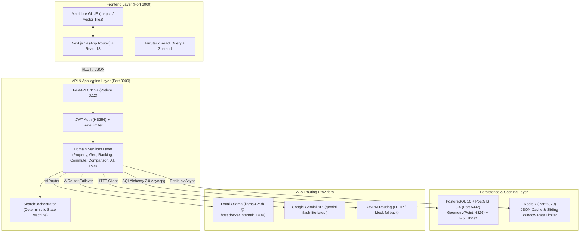

# EstateMap AI — Canonical Architecture Truth & System Topology
> **Document Status: Authoritative Architecture Specification (Canonical Truth)**

# EstateMap AI — Canonical Architecture Truth
> **Authoritative Executable Architecture Specification**
> *Reconciled directly from the codebase, tests, migrations, and runtime configuration.*

This document defines the **single source of truth** for EstateMap AI. Every engineering story, test evidence mapping, and curriculum document must conform strictly to these verified executable realities.

---

## 1. System Topology & Stack Overview

---

## 2. Verified Technology Stack

| Domain | Technology / Library | Version / Details | Code Reference |
| :--- | :--- | :--- | :--- |
| **Frontend Framework** | Next.js (App Router) | `14.2.15` (React `18.3.1`, TypeScript `5.6.3`) | `frontend/package.json` |
| **Frontend Styling** | Tailwind CSS | `3.4.13` + `tailwindcss-animate` + `clsx` | `frontend/tailwind.config.ts` |
| **Frontend State & Fetching** | TanStack Query + Zustand | `@tanstack/react-query: ^5.59.0`, `zustand: ^5.0.0` | `frontend/package.json` |
| **Map Rendering** | MapLibre GL JS | `maplibre-gl: ^6.7.0` (mapcn UI wrapper) | `frontend/components/map/` |
| **Backend Framework** | FastAPI | `0.115.0+` (Python `3.12.14` runtime) | `backend/pyproject.toml` |
| **Database Engine** | PostgreSQL + PostGIS | PostgreSQL `16`, PostGIS `3.4` | `docker-compose.yml` (`postgis/postgis:16-3.4`) |
| **Database Driver & ORM** | Asyncpg + SQLAlchemy | `SQLAlchemy: ^2.0.35`, `asyncpg: ^0.29.0`, `GeoAlchemy2` | `backend/app/db/session.py` |
| **Database Migrations** | Alembic | `1.13.3+` (4 linear migration versions) | `backend/alembic/versions/` |
| **Cache & Rate Limiting** | Redis | `redis:7-alpine` (`redis-py: ^5.0.8` async) | `backend/app/cache/` |
| **AI LLM Routing** | Multi-Provider Router | Primary: Local Ollama (`llama3.2:3b`); Fallback: Hosted Gemini (`gemini-flash-lite-latest`) | `backend/app/ai/router.py` |
| **Routing / Commute** | Mock / OSRM | `http://router.project-osrm.org` or in-memory mock | `backend/app/services/routing/` |

---

## 3. Verified Backend Modules & Symbol Mapping

| Domain Layer | File Path | Primary Classes / Functions | Purpose & Guarantees |
| :--- | :--- | :--- | :--- |
| **Application Main** | `backend/app/main.py` | `app`, `lifespan` | FastAPI app creation, middleware registration, lifespan database/redis initialization and graceful shutdown. |
| **Configuration** | `backend/app/core/config.py` | `Settings`, `settings` | Pydantic BaseSettings loading from `.env`. Central source of TTLs, limits, provider configurations. |
| **Security & Auth** | `backend/app/core/security.py` `backend/app/services/auth_service.py` | `create_access_token`, `verify_password`, `get_password_hash`, `AuthService` | JWT access token creation (HS256, 60 min expiration), Argon2/bcrypt password hashing. |
| **Rate Limiter** | `backend/app/core/rate_limit.py` | `RateLimiter`, `check_rate_limit` | Sliding Window Log using Redis Sorted Sets (`ZSET`). Non-atomic batch pipeline with optimistic rollback. |
| **Property Repo** | `backend/app/repositories/property_repository.py` | `PropertyRepository` | PostGIS spatial queries (`search_radius`, `search_bbox`), attribute filtering, sorting, pagination. |
| **Geo / Spatial** | `backend/app/services/geo_service.py` `backend/app/utils/geo.py` | `GeoService`, `coords_from_point`, `point_from_coords` | Geodesic transformations, viewport bounding box processing, GeoJSON FeatureCollection serialization. |
| **Ranking Engine** | `backend/app/services/ranking_service.py` `backend/app/utils/ranking.py` | `RankingService.rank_properties`, `calculate_price_score`, `calculate_bedroom_score`, `calculate_area_score`, `calculate_locality_score`, `calculate_location_score`, `calculate_commute_score` | 6-factor deterministic scoring, proportional weight redistribution, deterministic tie-breaking. |
| **Cache Service** | `backend/app/cache/cache_service.py` `backend/app/cache/cache_keys.py` | `CacheService` (`get`, `set`, `get_json`, `set_json`, `delete`, `delete_pattern`), `CacheKeys` | Redis cache management with deterministic namespacing (`estatemap:v1:...`) and non-blocking `SCAN` invalidation. |
| **AI Orchestration** | `backend/app/services/ai_service.py` `backend/app/ai/router.py` | `AIService`, `AIRouter`, `GeminiProvider`, `OllamaProvider`, `MockProvider` | Multi-provider AI orchestration with zero LLM database access, strict Pydantic parsing, and deterministic fallback. |
| **Data Synthesizer** | `backend/app/services/property_synthesizer.py` | `PropertySynthesizer.synthesize_for_locality` | On-demand dynamic real estate listing generation and persistence when 0 results match a requested locality or city. |
| **Search State** | `backend/app/services/search_orchestrator.py` `backend/app/schemas/conversational_search.py` | `SearchOrchestrator.apply_patch`, `ConversationalSearchState`, `SearchStatePatch` | Stateless server-side validated state machine applying client-supplied patches to search criteria. |
| **Location Resolver**| `backend/app/utils/location_resolver.py` | `LocationResolver.resolve_locality`, `KNOWN_LOCATIONS`, `METRO_BOUNDS` | Bounded in-memory dictionary lookup for Bengaluru and Chennai landmarks and IT corridors. |
| **Commute Service** | `backend/app/services/commute_service.py` `backend/app/services/routing/factory.py` | `CommuteService`, `RoutingProviderFactory`, `OSRMProvider`, `MockRoutingProvider` | Travel duration, distance, and GeoJSON LineString route generation. |
| **Comparison** | `backend/app/services/comparison_service.py` | `ComparisonService`, `format_inr_amount` | 2-3 property side-by-side comparison matrix with deterministic dimension winners and rank diffs. |

---

## 4. Database & PostGIS Geometry Truth

* **Model Column Definition (`backend/app/models/property.py`):**
  `location = mapped_column(Geometry(geometry_type="POINT", srid=4326, spatial_index=True), nullable=False)`
* **Storage Type:** PostGIS `geometry(Point, 4326)` indexed with a spatial **GiST index** (`idx_properties_location`).
* **Runtime Geodesic Queries:** Meter-based distance queries cast the geometry column to geography at query time:
  `func.ST_DWithin(func.cast(Property.location, Geography), origin_geog, radius_meters)`.
* **Bounding Box Queries:** Use `ST_Within(Property.location, ST_MakeEnvelope(min_lng, min_lat, max_lng, max_lat, 4326))`.

---

## 5. Actual Alembic Migration History

| Migration Filename | Revision ID | Down Revision | Primary Changes & Schema Evolutions |
| :--- | :---: | :---: | :--- |
| `2026_09_04_0001-0001_initial_postgis.py` | `0001` | *None* | Enables PostGIS database extension (`CREATE EXTENSION IF NOT EXISTS postgis;`). |
| `2026_09_04_0002-0002_create_users_table.py` | `0002` | `0001` | Creates `users` table (`id`, `email`, `hashed_password`, `full_name`, `is_active`, `is_superuser`, timestamps) with unique index on `email`. |
| `2026_09_04_0003-0003_create_properties_amenities_images.py` | `0003` | `0002` | Creates `amenities`, `properties`, `property_amenities`, and `property_images` tables. Adds `location` as `Geometry(Point, 4326)` with spatial GiST index and B-tree indexes on price, bedrooms, city, locality, status. |
| `2026_09_04_0004-0004_create_pois_table.py` | `0004` | `0003` | Creates `pois` table (`id`, `name`, `category`, `subcategory`, `location` as `Geometry(Point, 4326)`, `city`, `locality`, `is_active`) with spatial GiST index and category indexes. |

---

## 6. Runtime Configuration Constants

### Redis Cache TTLs (`backend/app/core/config.py`)
| Cache Domain | Config Key | Value (Seconds) | Human Duration | Purpose |
| :--- | :--- | :---: | :---: | :--- |
| **Map Viewport Properties** | `CACHE_MAP_TTL_SECONDS` | `120` | 2 minutes | High-frequency map viewport bounding box search results. |
| **Ranked Recommendations** | `CACHE_RANKING_TTL_SECONDS` | `300` | 5 minutes | Multi-factor ranked search results and scores. |
| **Commute & Road Routes** | `CACHE_ROUTE_TTL_SECONDS` | `600` | 10 minutes | OSRM / Mock road directions and GeoJSON LineStrings. |
| **POI Location Intelligence**| `CACHE_POI_TTL_SECONDS` | `1800` | 30 minutes | Per-property nearby POI counts and proximity maps. |
| **Coordinate Precision** | `CACHE_COORDINATE_PRECISION`| `4` decimals | ~11 meters | Coordinate rounding for deterministic cache key hashing. |

### Rate Limiting Policies (`backend/app/core/config.py`)
| Endpoint Domain | Config Requests Limit | Window Seconds | Fail Policy | Header Emitted |
| :--- | :---: | :---: | :---: | :--- |
| **Default Endpoints** | `100` | `60` | Fail-open (`True`) | `X-RateLimit-Limit`, `X-RateLimit-Remaining` |
| **Ranked Search** | `20` | `60` | Fail-open (`True`) | `X-RateLimit-Limit`, `X-RateLimit-Remaining` |
| **Commute Routes** | `30` | `60` | Fail-open (`True`) | `X-RateLimit-Limit`, `X-RateLimit-Remaining` |
| **Auth / Login** | `10` | `60` | Fail-open (`True`) | `X-RateLimit-Limit`, `X-RateLimit-Remaining` |
| **AI / AskMap** | `15` | `60` | Fail-open (`True`) | `X-RateLimit-Limit`, `X-RateLimit-Remaining` |

---

## 7. Health & Observability Endpoints

| Endpoint Route | Handler File | Probed Dependencies | HTTP Status on Failure |
| :--- | :--- | :--- | :---: |
| `GET /health/live` `GET /api/v1/health/live` | `backend/app/api/v1/health.py` | None (Process liveness probe) | `200 OK` |
| `GET /health/ready` `GET /api/v1/health/ready` | `backend/app/api/v1/health.py` | PostgreSQL/PostGIS connectivity + Redis ping | `503 Service Unavailable` if DB down |
| `GET /health` `GET /api/v1/health` | `backend/app/api/v1/health.py` | Comprehensive diagnostics (DB status, Redis status, pool statistics) | `200 OK` (returns `healthy`, `degraded`, or `unhealthy`) |

---

## 8. Docker Service Inventory (`docker-compose.yml`)

| Service Name | Base Image / Build Context | Container Name | Port Mappings | Healthcheck / Dependencies |
| :--- | :--- | :--- | :---: | :--- |
| `postgres-postgis` | `postgis/postgis:16-3.4` | `estatemap-postgres` | `5432:5432` | `pg_isready -U estatemap -d estatemap_db` |
| `redis` | `redis:7-alpine` | `estatemap-redis` | `6379:6379` | `redis-cli ping` |
| `backend` | `./backend` (Dockerfile, Python 3.12) | `estatemap-backend` | `8000:8000` | Depends on `postgres-postgis` (healthy) & `redis` (healthy) |
| `frontend` | `./frontend` (Dockerfile, Next.js 14) | `estatemap-frontend` | `3000:3000` | Depends on `backend` (started) |

---

## 9. Actual Seed Dataset Inventory

| Seed Source | Entity Type | Target City / Locality | Count | Verification File |
| :--- | :--- | :--- | :---: | :--- |
| `db/seed_all.py` | Properties | Bengaluru (Indiranagar, Koramangala, Whitefield, HSR) | **4** | `backend/app/db/seed_all.py` (`BENGALURU_PROPERTIES`) |
| `db/seed_all.py` | Properties | Chennai (OMR Corridor: Sholinganallur, Thoraipakkam, Perungudi, Velachery, Siruseri, etc.) | **100** | `backend/app/db/seed_all.py` (`CHENNAI_LOCALITIES`) |
| `db/seed_all.py` | POIs | Bengaluru & Chennai (Transit, Schools, Hospitals, Parks, Malls, Tech Parks) | **29** | `backend/app/db/seed_all.py` (`POIS`) |
| `db/seed_all.py` | Amenities | System-wide (Gym, Pool, Security, Power Backup, Clubhouse, etc.) | **12** | `backend/app/db/seed_all.py` (`AMENITIES`) |

---

## 10. Concrete Operational Limitations

1. **Location Resolution:** Handled via an authoritative in-memory registry of Bengaluru and Chennai tech corridors and landmarks (`backend/app/utils/location_resolver.py`). Live external geocoding network queries are not executed.
2. **Conversational State Ownership:** The server is stateless. The client application passes `ConversationalSearchState` with each request; `SearchOrchestrator` applies patches and returns the new state. No Redis session memory exists.
3. **Rate Limiter Concurrency:** Implemented via Redis `pipeline()`. Reduces network RTTs but does not provide multi-command ACID transaction guarantees unless executed as a Redis Lua script (`EVAL`).
4. **Routing Engine:** Configured by default with in-memory mock calculations (`mock`) or fallback to public OSRM demo server (`http://router.project-osrm.org`). No dedicated OSRM Docker container is provisioned in the baseline compose stack.

