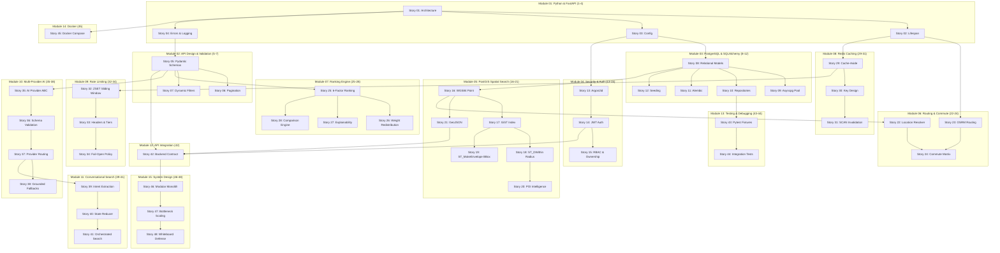

# EstateMap AI — Backend Learning Dependency Graph
> **Directed Acyclic Graph (DAG) for all 48 Backend Engineering Stories across 15 Modules**

```mermaid
flowchart TD
    subgraph M01["Module 01: Python & FastAPI (1-4)"]
        S01["Story 01: Architecture"] --> S02["Story 02: Lifespan"]
        S01 --> S03["Story 03: Config"]
        S01 --> S04["Story 04: Errors & Logging"]
    end

    subgraph M02["Module 02: API Design & Validation (5-7)"]
        S04 --> S05["Story 05: Pydantic Schemas"]
        S05 --> S06["Story 06: Pagination"]
        S05 --> S07["Story 07: Dynamic Filters"]
    end

    subgraph M03["Module 03: PostgreSQL & SQLAlchemy (8-12)"]
        S03 --> S08["Story 08: Relational Models"]
        S08 --> S09["Story 09: Asyncpg Pool"]
        S08 --> S10["Story 10: Repositories"]
        S08 --> S11["Story 11: Alembic"]
        S08 --> S12["Story 12: Seeding"]
    end

    subgraph M04["Module 04: Security & Auth (13-15)"]
        S03 --> S13["Story 13: Argon2id"]
        S13 --> S14["Story 14: JWT Auth"]
        S14 --> S15["Story 15: RBAC & Ownership"]
    end

    subgraph M05["Module 05: PostGIS Spatial Search (16-21)"]
        S08 --> S16["Story 16: WGS84 Point"]
        S16 --> S17["Story 17: GiST Index"]
        S17 --> S18["Story 18: ST_DWithin Radius"]
        S17 --> S19["Story 19: ST_MakeEnvelope BBox"]
        S18 --> S20["Story 20: POI Intelligence"]
        S16 --> S21["Story 21: GeoJSON"]
    end

    subgraph M06["Module 06: Routing & Commute (22-24)"]
        S16 --> S22["Story 22: Location Resolver"]
        S02 --> S23["Story 23: OSRM Routing"]
        S22 --> S24["Story 24: Commute Matrix"]
        S23 --> S24
    end

    subgraph M07["Module 07: Ranking Engine (25-28)"]
        S05 --> S25["Story 25: 6-Factor Ranking"]
        S25 --> S26["Story 26: Weight Redistribution"]
        S25 --> S27["Story 27: Explainability"]
        S25 --> S28["Story 28: Comparison Engine"]
    end

    subgraph M08["Module 08: Redis Caching (29-31)"]
        S02 --> S29["Story 29: Cache-Aside"]
        S29 --> S30["Story 30: Key Design"]
        S30 --> S31["Story 31: SCAN Invalidation"]
    end

    subgraph M09["Module 09: Rate Limiting (32-34)"]
        S29 --> S32["Story 32: ZSET Sliding Window"]
        S32 --> S33["Story 33: Headers & Tiers"]
        S33 --> S34["Story 34: Fail-Open Policy"]
    end

    subgraph M10["Module 10: Multi-Provider AI (35-38)"]
        S05 --> S35["Story 35: AI Provider ABC"]
        S35 --> S36["Story 36: Schema Validation"]
        S36 --> S37["Story 37: Provider Routing"]
        S37 --> S38["Story 38: Grounded Fallbacks"]
    end

    subgraph M11["Module 11: Conversational Search (39-41)"]
        S37 --> S39["Story 39: Intent Extraction"]
        S39 --> S40["Story 40: State Reducer"]
        S40 --> S41["Story 41: Orchestrated Search"]
    end

    subgraph M12["Module 12: API Integration (42)"]
        S05 --> S42["Story 42: Backend Contract"]
        S14 --> S42
        S21 --> S42
    end

    subgraph M13["Module 13: Testing & Debugging (43-44)"]
        S10 --> S43["Story 43: Pytest Fixtures"]
        S43 --> S44["Story 44: Integration Tests"]
    end

    subgraph M14["Module 14: Docker (45)"]
        S01 --> S45["Story 45: Docker Compose"]
    end

    subgraph M15["Module 15: System Design (46-48)"]
        S42 --> S46["Story 46: Modular Monolith"]
        S46 --> S47["Story 47: Bottleneck Scaling"]
        S47 --> S48["Story 48: Whiteboard Defense"]
    end
```
