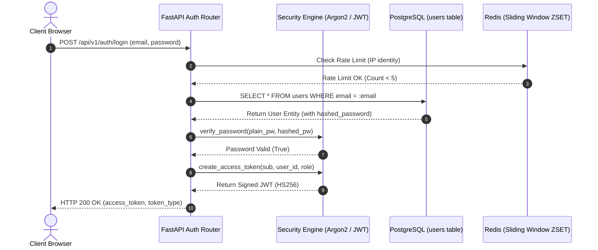
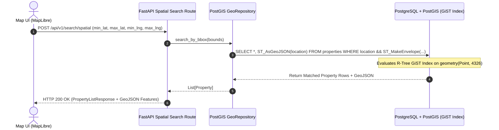
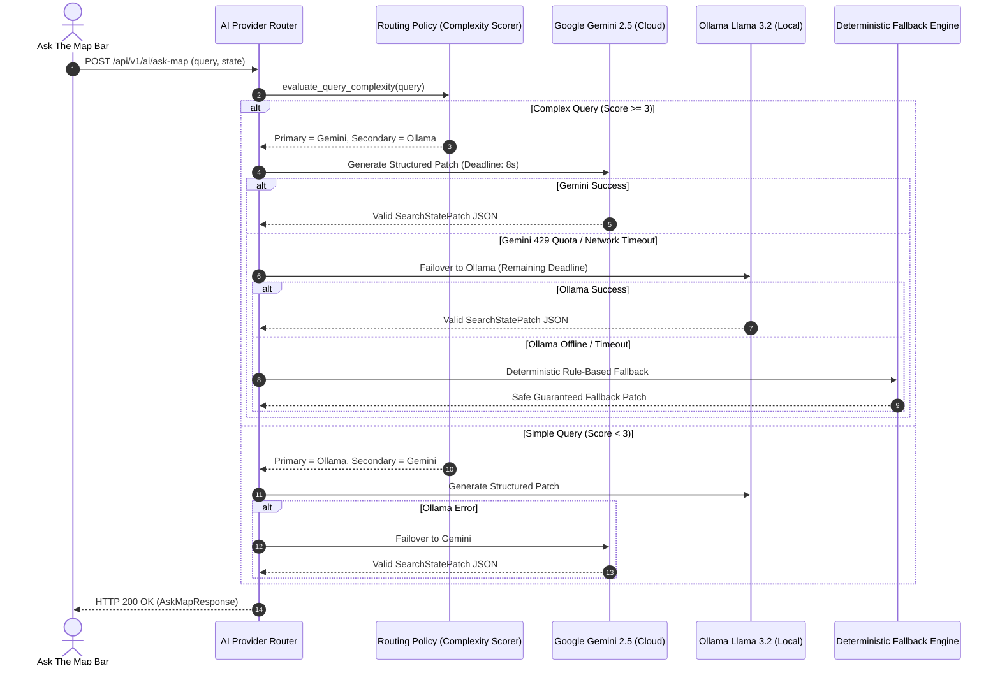

# EstateMap AI — Architectural Data Flows

This document visualizes the complete architectural data flows across the EstateMap AI platform using Mermaid diagrams.

---

## 1. Authentication & Security Flow



---

## 2. PostGIS Spatial Bounding-Box Flow



---

## 3. Road-Network Commute & Caching Flow

```mermaid
sequenceDiagram
    autonumber
    actor User as Commute Panel
    participant CommuteAPI as FastAPI Commute Route
    participant Cache as Redis In-Memory Cache
    participant OSRM as OSRM Road Graph Engine
    participant DB as PostGIS (Fallback)

    User->>CommuteAPI: POST /api/v1/commute/route (origin, dest, mode)
    CommuteAPI->>Cache: GET estatemap:commute:v1:origin_dest:mode
    alt Cache Hit
        Cache-->>CommuteAPI: Return Cached Route JSON
    else Cache Miss
        CommuteAPI->>OSRM: HTTP GET /route/v1/{mode}/{lng1},{lat1};{lng2},{lat2}
        alt OSRM Success
            OSRM-->>CommuteAPI: Return Road Duration (s), Distance (m), GeoJSON LineString
            CommuteAPI->>Cache: SETEX key 86400 (Route JSON)
        else OSRM Timeout / Error
            CommuteAPI->>DB: Compute ST_DistanceSphere() Euclidean fallback
            DB-->>CommuteAPI: Return Spherical Distance / Average Speed
        end
    end
    CommuteAPI-->>User: HTTP 200 OK (CommuteResponse + GeoJSON Route)
```

---

## 4. Multi-Provider AI Failover Flow


