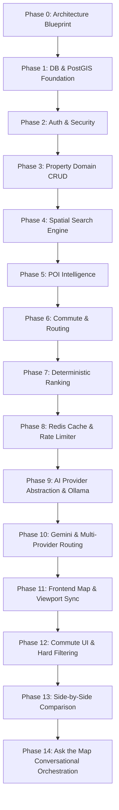
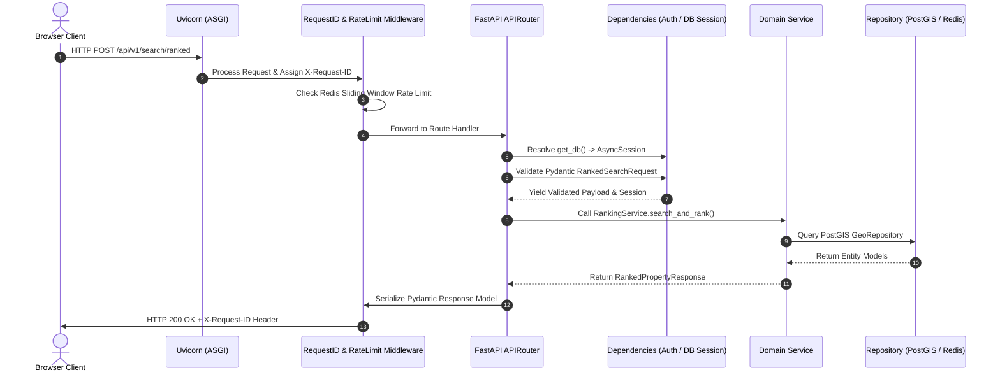
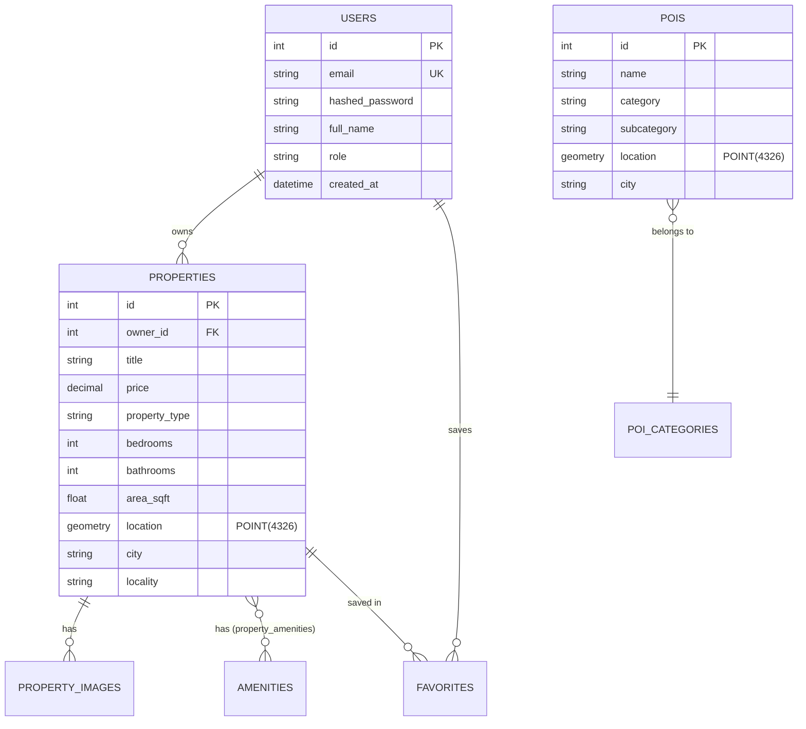
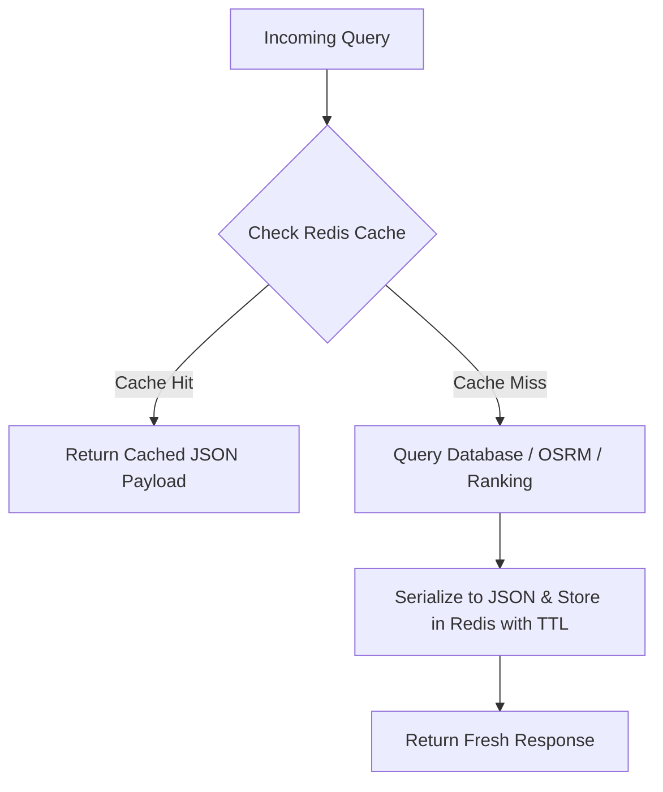
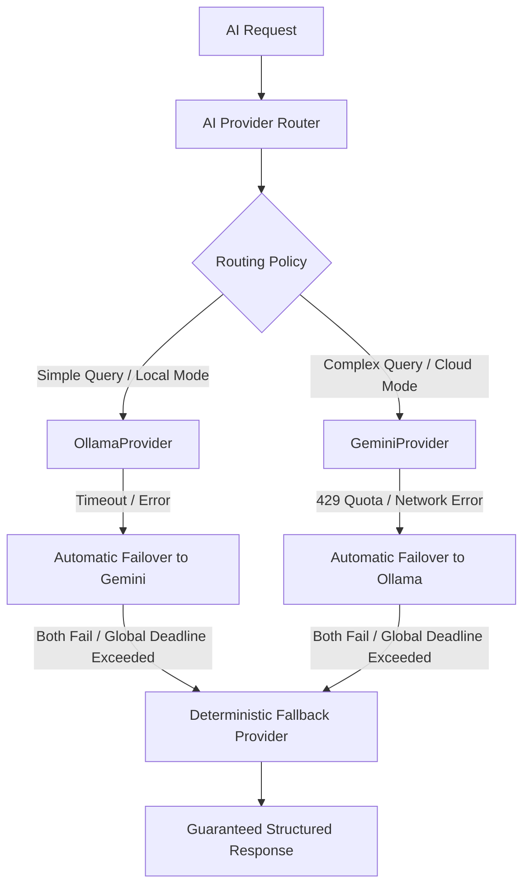
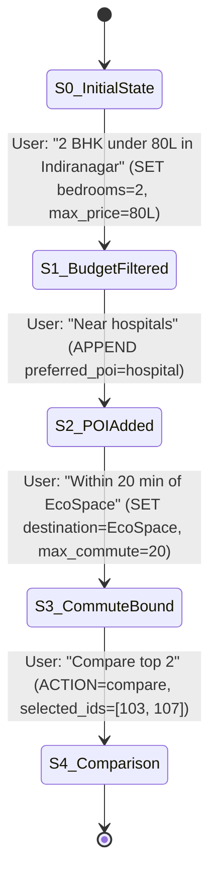

# EstateMap AI — System Design & Engineering Master Book

> **The Definitive Engineering Guide and Architectural Defense for the EstateMap AI Platform.**  
> *Targeted at Backend Engineers, Full-Stack Architects, and Technical Interview Preparation.*

---

# Table of Contents
1. [Chapter 1: What EstateMap AI Actually Is](#chapter-1-what-estatemap-ai-actually-is)
2. [Chapter 2: Requirements Engineering & Architectural Consequences](#chapter-2-requirements-engineering--architectural-consequences)
3. [Chapter 3: Architectural Evolution (Phase 0 to Phase 14)](#chapter-3-architectural-evolution-phase-0-to-phase-14)
4. [Chapter 4: FastAPI & ASGI Deep Dive](#chapter-4-fastapi--asgi-deep-dive)
5. [Chapter 5: Request Lifecycles & Dependency Injection](#chapter-5-request-lifecycles--dependency-injection)
6. [Chapter 6: Error Taxonomy & Middleware](#chapter-6-error-taxonomy--middleware)
7. [Chapter 7: Async Python Internals & Non-Blocking I/O](#chapter-7-async-python-internals--non-blocking-io)
8. [Chapter 8: PostgreSQL & Relational Modeling](#chapter-8-postgresql--relational-modeling)
9. [Chapter 9: PostGIS Geospatial Masterclass](#chapter-9-postgis-geospatial-masterclass)
10. [Chapter 10: Authentication, Authorization & Security](#chapter-10-authentication-authorization--security)
11. [Chapter 11: Redis In-Memory Caching Architecture](#chapter-11-redis-in-memory-caching-architecture)
12. [Chapter 12: Sliding-Window Rate Limiting Engine](#chapter-12-sliding-window-rate-limiting-engine)
13. [Chapter 13: Caching vs. Rate Limiting Deep Dive](#chapter-13-caching-vs-rate-limiting-deep-dive)
14. [Chapter 14: Commute & Routing Intelligence Engine](#chapter-14-commute--routing-intelligence-engine)
15. [Chapter 15: POI & Location Intelligence](#chapter-15-poi--location-intelligence)
16. [Chapter 16: Deterministic Multi-Factor Ranking Engine](#chapter-16-deterministic-multi-factor-ranking-engine)
17. [Chapter 17: Why Ranking is Heuristic and NOT Machine Learning](#chapter-17-why-ranking-is-heuristic-and-not-machine-learning)
18. [Chapter 18: Deterministic Property Comparison Engine](#chapter-18-deterministic-property-comparison-engine)
19. [Chapter 19: AI Multi-Provider Architecture & Resilient Routing](#chapter-19-ai-multi-provider-architecture--resilient-routing)
20. [Chapter 20: Local Inference with Ollama](#chapter-20-local-inference-with-ollama)
21. [Chapter 21: Cloud Inference with Google Gemini](#chapter-21-cloud-inference-with-google-gemini)
22. [Chapter 22: AI Provider Routing Policy & Global Deadlines](#chapter-22-ai-provider-routing-policy--global-deadlines)
23. [Chapter 23: Prompt Injection & AI Security Boundaries](#chapter-23-prompt-injection--ai-security-boundaries)
24. [Chapter 24: "Ask the Map" Conversational Search Orchestrator](#chapter-24-ask-the-map-conversational-search-orchestrator)
25. [Chapter 25: Finite State Machine Thinking & Conversational Reducers](#chapter-25-finite-state-machine-thinking--conversational-reducers)
26. [Chapter 26: Frontend Next.js App Router Architecture](#chapter-26-frontend-nextjs-app-router-architecture)
27. [Chapter 27: MapLibre & Mapcn Synchronization Engine](#chapter-27-maplibre--mapcn-synchronization-engine)
28. [Chapter 28: Containerization & Docker Networking](#chapter-28-containerization--docker-networking)
29. [Chapter 29: Database Migrations with Alembic](#chapter-29-database-migrations-with-alembic)
30. [Chapter 30: Comprehensive Testing Strategy & Fixture Design](#chapter-30-comprehensive-testing-strategy--fixture-design)
31. [Chapter 31: Observability, Request Tracking & Metrics](#chapter-31-observability-request-tracking--metrics)
32. [Chapter 32: Enterprise Failure Modes & Resilience Patterns](#chapter-32-enterprise-failure-modes--resilience-patterns)

---

# Chapter 1: What EstateMap AI Actually Is

EstateMap AI is a **location-first, deterministic real estate discovery platform** built using a modular monolithic architecture. Unlike legacy real estate portals that treat geography as a secondary string filter (e.g., searching for "Koramangala" as a text match), EstateMap AI treats **spatial coordinates, road-network commute times, surrounding point-of-interest (POI) density, and mathematical multi-factor scoring as first-class domain primitives**.

```
                           ┌────────────────────────────────────────────────┐
                           │               Frontend Client                  │
                           │   Next.js 14 App Router + MapLibre GL + mapcn  │
                           └───────────────────────┬────────────────────────┘
                                                   │ HTTPS / REST (JSON)
                                                   ▼
┌───────────────────────────────────────────────────────────────────────────────────────────────────┐
│                                FastAPI Modular Monolith (Port 8000)                               │
│                                                                                                   │
│   ┌───────────────────────────────────────────────────────────────────────────────────────────┐   │
│   │                      API Layer (v1 Routes) & Request Middleware                           │   │
│   │   /auth  /properties  /maps/search  /commute  /recommendations  /ai/ask-map  /ai/explain │   │
│   └──────────────────────────┬─────────────────────────────┬──────────────────────────┬───────┘   │
│                              │                             │                          │           │
│   ┌──────────────────────────▼──────────────┐ ┌────────────▼───────────┐ ┌────────────▼────────┐  │
│   │        Core Geospatial & Domain         │ │   Redis Cache & Rate   │ │   AI Multi-Provider    │  │
│   │   - GeoRepository (PostGIS GiST)        │ │     Limiting Engine    │ │        Router          │  │
│   │   - RankingService (Deterministic math) │ │  - Cache-aside routes  │ │  - Ollama (Local)      │  │
│   │   - ComparisonService (Fact delta math) │ │  - POI / Rank cache    │ │  - Gemini 2.5 (Cloud)  │  │
│   │   - CommuteService (OSRM Road Network)  │ │  - Sliding-window ZSET │ │  - Fallback Provider   │  │
│   │   - SearchOrchestrator (State Reducer)  │ │    rate limiter        │ │  - Deadlines & Schemas │  │
│   └──────────────────────────┬──────────────┘ └────────────┬───────────┘ └────────────┬─────────┘  │
└──────────────────────────────┼─────────────────────────────┼──────────────────────────┼───────────┘
                               │                             │                          │
                               ▼                             ▼                          ▼
               ┌───────────────────────────────┐ ┌───────────────────────┐ ┌────────────────────────┐
               │     PostgreSQL 16 + PostGIS   │ │    Redis 7 (Memory)   │ │  OSRM / Host Ollama /  │
               │  - geometry(Point, 4326)      │ │  - TTL Cache Keys     │ │    Google Gemini API   │
               │  - Spatial GiST Indexes       │ │  - Sliding Window ZSET│ └────────────────────────┘
               │  - Relational Models & Foreign│ └───────────────────────┘
               │    Key Integrity Constraints  │
               └───────────────────────────────┘
```

### The 5 Core Capabilities
1. **True Spatial Discovery**: PostGIS-powered bounding-box (`ST_MakeEnvelope`) and radial distance (`ST_DWithin`) filtering executed directly inside the database kernel with R-Tree spatial indexing.
2. **Actual Road-Network Commute Times**: Integrates Open Source Routing Machine (OSRM) to calculate realistic driving, transit, cycling, and walking durations across real road networks rather than straight-line geometric approximations.
3. **Deterministic Multi-Factor Ranking**: A 6-dimension mathematical scoring engine that ranks properties according to price compliance, bedroom matches, living area, locality preference, POI proximity, and commute duration with explicit missing-factor weight redistribution.
4. **Non-Authoritative Grounded AI**: Large Language Models (Gemini & Ollama) are used exclusively for natural language intent extraction and explanatory narratives. **The AI is strictly prohibited from inventing facts, executing database queries directly, or altering ranking scores.**
5. **Stateful Conversational Map Exploration ("Ask the Map")**: Multi-turn natural language query refinement that parses delta patches (`SET`, `CLEAR`, `APPEND`, `REMOVE`, `RESET`) against an explicit search state machine.

---

# Chapter 2: Requirements Engineering & Architectural Consequences

Every architecture decision in EstateMap AI directly maps to an explicit functional or non-functional requirement.

| Requirement Type | Explicit Requirement | Technical Consequence | Chosen Implementation | Rejected Alternative & Why |
| :--- | :--- | :--- | :--- | :--- |
| **Functional** | Filter properties within the visible map viewport. | Must query 2D geometric coordinates across bounding boxes. | PostGIS `ST_MakeEnvelope` with GiST spatial index. | Application-side filtering (pulls entire dataset into memory; O(N) network and memory cost). |
| **Functional** | Rank properties by commute time to user work hub. | Must compute road distances, not Euclidean distance. | OSRM routing provider with Redis caching. | PostGIS straight-line math (ignores rivers, one-ways, highways). |
| **Functional** | Compare 2-3 properties side-by-side. | Need deterministic winner calculations and ranking deltas. | `ComparisonService` calculating exact numeric deltas + AI explaining grounded facts. | Pure LLM comparison (LLMs hallucinate numeric values and have no deterministic consistency). |
| **Non-Functional** | Sub-50ms response times for repeated spatial/commute queries. | Must prevent redundant routing calculations. | Cache-aside with Redis using normalized canonical keys. | In-process Python cache (lost on restart, unshared across replicas). |
| **Non-Functional** | Prevent API abuse and DoS attacks. | Must limit request frequency per user/IP. | Sliding-window log using Redis Sorted Sets (`ZSET`). | Fixed window (allows 2x burst at boundary); Leaky bucket (complex sync). |
| **Non-Functional** | Zero-downtime offline capability for AI parsing. | Must support local and cloud LLM execution. | Abstract `AIProvider` protocol with Ollama + Gemini + Deterministic Fallback. | Cloud-only AI (fails when internet is down or API quota exhausted). |

---

# Chapter 3: Architectural Evolution (Phase 0 to Phase 14)

The platform was engineered incrementally in a strict dependency chain:



1. **Phases 0–3 (Core Foundation)**: Built the PostgreSQL relational schema, PostGIS geometry types, JWT authentication, and property repository.
2. **Phases 4–7 (Spatial & Domain Intelligence)**: Added `ST_MakeEnvelope` bounding-box search, POI density queries, OSRM road-network commute calculation, and the 6-factor deterministic ranking engine.
3. **Phases 8–10 (Performance & AI Abstraction)**: Introduced Redis cache-aside, sliding-window rate limiting, and the multi-provider AI protocol with global deadlines and deterministic fallback.
4. **Phases 11–14 (Interactive UI & Conversational Search)**: Implemented MapLibre WebGL map synchronization, side-by-side comparison with ranking deltas, and the "Ask the Map" multi-turn conversational state reducer.

---

# Chapter 4: FastAPI & ASGI Deep Dive

FastAPI operates as an asynchronous application on the **Asynchronous Server Gateway Interface (ASGI)** specification.

### Why ASGI Over WSGI?
Traditional Python web applications (Flask, Django) used WSGI (`PEP 3333`), which is inherently synchronous and single-threaded per request. Under WSGI, when a worker queries PostgreSQL or OSRM, the entire thread blocks.

ASGI (`PEP 3112`) decouples the web server (Uvicorn) from the application using non-blocking asynchronous coroutines. When a request waits for PostGIS or Redis, the Python event loop yields execution to handle hundreds of concurrent requests on the same thread.

```
WSGI (Synchronous):
Thread 1: [--- Read HTTP ---][====== Wait DB (50ms) ======][--- Write Response ---]
(Thread is 100% blocked during the 50ms database wait)

ASGI (Asynchronous Event Loop):
Loop: [Req 1 Read] -> [Req 1 DB Sent] -> [Req 2 Read] -> [Req 3 Read] -> [Req 1 DB Done -> Respond]
(Event loop processes other requests while I/O waits)
```

---

# Chapter 5: Request Lifecycles & Dependency Injection

Every request in EstateMap AI passes through a deterministic pipeline:



### Dependency Injection (`backend/app/core/dependencies.py`)
FastAPI's dependency injection system manages database connection lifecycles:
```python
async def get_db() -> AsyncGenerator[AsyncSession, None]:
    async with async_session_factory() as session:
        try:
            yield session
            await session.commit()
        except Exception:
            await session.rollback()
            raise
        finally:
            await session.close()
```
* **Guaranteed Rollback**: If an unhandled exception occurs in any service, the database transaction is automatically rolled back.
* **Guaranteed Cleanup**: The `finally` block ensures connections return to the `NullPool` or engine pool, eliminating connection leaks.

---

# Chapter 6: Error Taxonomy & Middleware

EstateMap AI implements a centralized exception handling architecture (`backend/app/core/exception_handlers.py`). Every error produces a standardized RFC 7807 JSON response:

```json
{
  "status_code": 404,
  "error_code": "PROPERTY_NOT_FOUND",
  "message": "Property with ID 999 does not exist.",
  "request_id": "req_8a3f91c2b5",
  "details": {}
}
```

### Error Code Hierarchy
* `VALIDATION_ERROR` (422): Malformed JSON, coordinates out of bounds (lat not in `[-90, 90]`), or negative price.
* `AUTHENTICATION_ERROR` (401): Missing or expired JWT token, invalid signature.
* `AUTHORIZATION_ERROR` (403): Attempting to mutate a listing owned by another user ID.
* `NOT_FOUND` (404): Non-existent property, POI, or user ID.
* `RATE_LIMIT_EXCEEDED` (429): Sliding-window rate limit exceeded (returns `Retry-After: 60`).
* `AI_PROVIDER_ERROR` (502 / 504): LLM timeout or unparseable output (triggers fallback).

---

# Chapter 7: Async Python Internals & Non-Blocking I/O

Async Python operates on a single-threaded **Event Loop** (`asyncio`).

```python
# Non-blocking async execution in EstateMap
async def get_property_commute(property_id: int, dest_lat: float, dest_lng: float):
    # 1. Non-blocking Redis check
    cached = await cache_service.get_commute(property_id, dest_lat, dest_lng)
    if cached:
        return cached

    # 2. Non-blocking DB fetch
    prop = await property_repo.get_by_id(property_id)

    # 3. Non-blocking HTTP call to OSRM
    route = await routing_client.calculate_route(prop.latitude, prop.longitude, dest_lat, dest_lng)
    
    # 4. Non-blocking cache store
    await cache_service.set_commute(property_id, dest_lat, dest_lng, route)
    return route
```

> [!WARNING]
> **The Golden Rule of Async Python**: NEVER invoke blocking synchronous functions (e.g. `time.sleep()`, `requests.get()`, `psycopg2.connect()`) inside async coroutines. Doing so blocks the entire event loop, preventing all other concurrent requests from progressing.

---

# Chapter 8: PostgreSQL & Relational Modeling

EstateMap uses PostgreSQL 16 with a clean normalized relational schema:



### Foreign Key & Cascade Policies
* `properties.owner_id -> users.id` (`ON DELETE RESTRICT`): Prevents deleting a user while their active listings exist.
* `property_images.property_id -> properties.id` (`ON DELETE CASCADE`): Deleting a property automatically removes all associated image records.
* `property_amenities` composite primary key `(property_id, amenity_id)`: Enforces uniqueness at the database level, preventing duplicate amenities on the same listing.

---

# Chapter 9: PostGIS Geospatial Masterclass

### Coordinate Systems & SRID 4326
PostGIS stores spatial coordinates using **Spatial Reference System Identifier (SRID) 4326** (WGS 84), which models coordinates as degrees of longitude and latitude on the Earth's ellipsoidal surface.

> [!IMPORTANT]
> **Coordinate Ordering Convention**:
> * **PostGIS / GeoJSON / WKT Standard**: `POINT(longitude latitude)` -> `[x, y] = [lng, lat]`
> * **Human / UI Standard**: `(latitude, longitude)` -> `[lat, lng]`
> * *Passing `POINT(lat lng)` into PostGIS will invert coordinates across the globe and result in empty query results.*

### Spatial Queries in EstateMap

#### 1. Bounding-Box Viewport Search (`backend/app/repositories/geo_repository.py`)
```sql
SELECT id, title, price, bedrooms, area_sqft, ST_AsGeoJSON(location)
FROM properties
WHERE location && ST_MakeEnvelope(:min_lng, :min_lat, :max_lng, :max_lat, 4326)
  AND status = 'active';
```
* The `&&` operator is the **PostGIS 2D bounding-box intersection operator**.
* Evaluated against the **GiST (Generalized Search Tree)** index in `O(log N)` time.

#### 2. Radius Distance Search (`ST_DWithin`)
```sql
SELECT id, name, category, ST_DistanceSphere(location, ST_MakePoint(:lng, :lat)) AS distance_meters
FROM pois
WHERE ST_DWithin(
    location::geography,
    ST_MakePoint(:lng, :lat)::geography,
    :radius_meters
)
ORDER BY distance_meters ASC;
```
* Casting `geometry` to `geography` tells PostGIS to calculate distances along the great-circle curve of the Earth in **meters**, rather than planar degrees.

---

# Chapter 10: Authentication, Authorization & Security

EstateMap AI implements stateless JSON Web Token (JWT) authentication:

```
                  ┌──────────────────────────────────────────┐
                  │          JWT Anatomy (HS256)             │
                  ├──────────────────────────────────────────┤
                  │ Header:    {"alg": "HS256", "typ": "JWT"}│
                  │ Payload:   {"sub": "user@example.com",   │
                  │             "user_id": 42,               │
                  │             "role": "agent",             │
                  │             "exp": 1725540000}           │
                  │ Signature: HMACSHA256(Header.Payload, K) │
                  └──────────────────────────────────────────┘
```

### Password Hashing Security
Passwords are never stored in plaintext. `backend/app/core/security.py` uses **Argon2id** with salt generation to defend against rainbow table attacks and GPU-accelerated hashing engines.

### Ownership Authorization Rule
When modifying or deleting a property listing (`PUT /api/v1/properties/{id}`), the API executes an ownership check:
```python
if property.owner_id != current_user.id and current_user.role != "admin":
    raise HTTPException(status_code=403, detail="Not authorized to modify this listing")
```

---

# Chapter 11: Redis In-Memory Caching Architecture

EstateMap AI uses Redis 7 as an in-memory cache-aside store.



### Canonical Cache Key Design
Cache keys are deterministically structured with domain prefixes and canonical parameter hashes (`backend/app/cache/cache_keys.py`):
* **Commute Route**: `estatemap:commute:v1:p{prop_id}:d{dest_lat:.4f}_{dest_lng:.4f}:m{mode}` (TTL: 86400s / 24h)
* **POI Location Intelligence**: `estatemap:poi:intelligence:v1:p{prop_id}:r{radius_meters}` (TTL: 3600s / 1h)
* **Ranked Search**: `estatemap:rank:v1:{sha256(canonical_params)}` (TTL: 300s / 5m)

### Cache Stampede & Avalanche Defenses
1. **TTL Jitter**: Expirations use randomized offsets to prevent thousands of keys expiring at the same second.
2. **Fail-Open Resilience**: If Redis crashes or disconnects, the backend logs a warning and transparently queries PostgreSQL/OSRM directly without failing user requests.

---

# Chapter 12: Sliding-Window Rate Limiting Engine

EstateMap AI implements a precise **Sliding-Window Log Rate Limiter** using Redis Sorted Sets (`ZSET`) in `backend/app/core/rate_limit.py`.

```
Rate Limit Window: 60 Seconds (Limit: 5 Requests)
Current Time: T = 100

Redis ZSET: [key = "estatemap:ratelimit:ip:192.168.1.1"]
Member (Score = Timestamp):
  (42, "req_42")  <-- EXPIRED (100 - 60 = 40; 42 > 40 keep)
  (35, "req_35")  <-- PURGED via ZREMRANGEBYSCORE(0, 40)
  (55, "req_55")
  (70, "req_70")
  (90, "req_90")
  (98, "req_98")

Count remaining: 4 requests in current 60s window.
Current request accepted (4 < 5) -> ZADD(100, "req_100") -> EXPIRE(60)
```

### The Atomic Sliding-Window Algorithm
1. Key: `estatemap:ratelimit:{user_id_or_ip}:{endpoint_scope}`
2. Remove all entries older than `now - window_seconds`:
   `ZREMRANGEBYSCORE key 0 (now - window_seconds)`
3. Count remaining entries in the set:
   `count = ZCARD key`
4. If `count >= limit`:
   Reject request with `HTTP 429 Too Many Requests` and header `Retry-After: 60`.
5. Otherwise:
   Add current request: `ZADD key now request_uuid`
   Set key expiration: `EXPIRE key window_seconds`

---

# Chapter 13: Caching vs. Rate Limiting Deep Dive

| Dimension | In-Memory Caching (Redis Strings/Hashes) | Sliding-Window Rate Limiting (Redis Sorted Sets) |
| :--- | :--- | :--- |
| **Primary Objective** | Eliminate redundant computation and expensive I/O. | Protect backend resources from abuse and DoS attacks. |
| **Data Structure** | Key-Value Strings containing serialized JSON. | Sorted Sets (`ZSET`) where Score = Epoch Timestamp. |
| **Behavior on Failure** | **Fail-Open**: Query database/provider directly. | **Fail-Open** on general search; **Fail-Closed** on auth endpoints. |
| **Mutation Frequency** | Written once on cache miss; read many times. | Written and pruned on *every single incoming request*. |

---

# Chapter 14: Commute & Routing Intelligence Engine

EstateMap AI abstracts road-network routing through the `RoutingProvider` protocol (`backend/app/services/routing_service.py`):

```
                        ┌──────────────────────────────┐
                        │   CommuteService (Domain)    │
                        └──────────────┬───────────────┘
                                       │
                        ┌──────────────▼───────────────┐
                        │   RoutingProvider Protocol   │
                        └──────┬───────────────┬───────┘
                               │               │
            ┌──────────────────▼──┐         ┌──▼──────────────────┐
            │ OSRMProvider (HTTP) │         │ MockRoutingProvider │
            │ Calls OSRM Server   │         │ Fast Test Execution │
            └─────────────────────┘         └─────────────────────┘
```

### Why Road Graphs Instead of PostGIS?
PostGIS computes planar or spherical geometric lines. A straight-line distance of 3 km across a river with no bridge might require a 15 km driving route taking 35 minutes. OSRM evaluates the directed road-network graph, speed limits, and one-way streets to return the actual travel duration and turn-by-turn GeoJSON LineString.

---

# Chapter 15: POI & Location Intelligence

The system categorizes surrounding points of interest (POIs) into standard urban dimensions:
* `transit` (Metro stations, bus terminals, railway stations)
* `school` (Colleges, primary schools, international schools)
* `hospital` (Multispecialty hospitals, clinics, emergency centers)
* `park` (Public parks, recreation grounds, botanical gardens)
* `shopping` (Malls, supermarkets, shopping complexes)
* `workplace` (Tech parks, IT corridors, business centers)

### Location Intelligence Aggregation
For any property, `LocationIntelligenceService` executes a single bounded spatial query that groups POIs by category, calculating:
1. `total_count` of POIs within radius (e.g. 2000m).
2. `nearest_poi`: Name and exact distance in meters to the closest facility in each category.

---

# Chapter 16: Deterministic Multi-Factor Ranking Engine

EstateMap AI ranks properties using a 100% deterministic mathematical scoring model (`backend/app/services/ranking_service.py`).

### The 6 Mathematical Scoring Factors

$$\text{FinalScore}(P) = \sum_{f \in \text{Factors}} \text{EffectiveWeight}(f, P) \times \text{Score}(f, P) \times 100$$

#### 1. Price Score ($S_{\text{price}}$)
Given target budget $B_{\text{target}}$ and property price $P_{\text{price}}$:
$$S_{\text{price}} = \max\left(0, 1 - \frac{|P_{\text{price}} - B_{\text{target}}|}{B_{\text{target}}}\right)$$

#### 2. Bedroom Score ($S_{\text{bedrooms}}$)
Given target bedrooms $B_{\text{target}}$ and property bedrooms $P_{\text{bed}}$:
$$S_{\text{bedrooms}} = \max\left(0, 1 - 0.5 \times |P_{\text{bed}} - B_{\text{target}}|\right)$$

#### 3. Area Score ($S_{\text{area}}$)
Given minimum preferred area $A_{\text{min}}$ and property area $P_{\text{area}}$:
$$S_{\text{area}} = \min\left(1.0, \frac{P_{\text{area}}}{A_{\text{min}}}\right)$$

#### 4. Locality Score ($S_{\text{locality}}$)
$$S_{\text{locality}} = \begin{cases} 1.0 & \text{if property locality matches target locality} \\ 0.0 & \text{otherwise} \end{cases}$$

#### 5. Location/POI Score ($S_{\text{location}}$)
Given $N$ user-selected preferred POI categories and available categories within radius $M$:
$$S_{\text{location}} = \frac{M}{N}$$

#### 6. Commute Score ($S_{\text{commute}}$)
Given commute duration $T_{\text{minutes}}$:
$$S_{\text{commute}} = \max\left(0, 1 - \frac{T_{\text{minutes}}}{60}\right)$$

### Missing-Factor Weight Redistribution
If a user specifies no commute destination, the commute factor is **unavailable**. Rather than penalizing properties with a score of 0, the system redistributes the missing weight proportionally across all available factors:

$$\text{EffectiveWeight}(f, P) = \frac{\text{BaseWeight}(f)}{\sum_{g \in \text{AvailableFactors}(P)} \text{BaseWeight}(g)}$$

---

# Chapter 17: Why Ranking is Heuristic and NOT Machine Learning

EstateMap AI uses deterministic heuristic equations rather than deep learning or ML ranking models for four architectural reasons:
1. **Explainability & Transparency**: Real estate buyers require clear, audit-proof explanations for why Property A outranks Property B (e.g., *"Ranked higher due to 12-min commute vs 28-min commute"*).
2. **Cold Start & Zero Click-Log Dependency**: ML ranking models (such as LambdaMART or Two-Tower embeddings) require millions of user interaction events (clicks, favorites, bookings). A new real estate platform starts with zero historical interaction logs.
3. **Product Control & Safety**: Heuristics allow instant tuning of factor weights (e.g. prioritizing commute over price) without retraining models.
4. **Reproducibility**: Deterministic math produces identical ranks across identical inputs, allowing reliable integration testing.

---

# Chapter 18: Deterministic Property Comparison Engine

The Comparison Engine (`backend/app/services/comparison_service.py`) provides side-by-side evaluation of 2 to 3 properties.

### Fact Ownership Separation
* **ComparisonService (Deterministic Truth)**: Calculates exact arithmetic deltas:
  * Price difference ($\Delta \text{Price} = P_1.\text{price} - P_2.\text{price}$)
  * Area difference ($\Delta \text{Area} = P_1.\text{area} - P_2.\text{area}$)
  * Commute duration difference ($\Delta \text{Commute} = P_1.\text{duration} - P_2.\text{duration}$)
  * Dimension Winners (e.g., Property 1 wins on Price; Property 2 wins on Living Area).
* **AI Provider (Narrative Explainer)**: Ingests the pre-computed mathematical deltas and generates a natural language summary. The AI cannot invent new comparison metrics.

---

# Chapter 19: AI Multi-Provider Architecture & Resilient Routing

EstateMap AI implements a multi-tier provider abstraction (`backend/app/ai/`):



---

# Chapter 20: Local Inference with Ollama

* **Implementation**: `backend/app/ai/ollama_provider.py`
* **Protocol**: HTTP REST calls to Ollama daemon on `http://host.docker.internal:11434/api/generate`.
* **Models**: `llama3.2:latest`, `qwen2.5:latest`.
* **Advantages**: Zero per-token cloud costs, complete data privacy, offline development.
* **Timeout & Deadlines**: Strict 8.0s timeout per inference call.

---

# Chapter 21: Cloud Inference with Google Gemini

* **Implementation**: `backend/app/ai/gemini_provider.py`
* **SDK**: `google-genai` official SDK calling Gemini 2.5 Flash / Pro.
* **Structured Output**: Enforces Pydantic schema generation directly at the LLM decoding stage (`response_mime_type="application/json"`).
* **Advantages**: High-speed cloud execution (<1200ms latency), broad general knowledge of urban landmarks.

---

# Chapter 22: AI Provider Routing Policy & Global Deadlines

### Complexity Scoring (`backend/app/ai/routing_policy.py`)
Incoming natural language queries are evaluated for syntactic and semantic complexity:
* Length > 100 characters (+1)
* Mentions multiple POI categories (+2)
* Contains relative commute and budget constraints (+2)
* Query score $\ge 3$ routes to **Gemini (Cloud)**; Query score $< 3$ routes to **Ollama (Local)**.

### Global Deadline Management
Every AI request is bounded by a **Global Deadline** (default: 12.0 seconds). If Primary Provider consumes 7.5s before failing, Secondary Provider is allocated only the remaining $12.0 - 7.5 = 4.5\text{s}$. If time runs out, the request immediately yields to the **Deterministic Fallback Provider**.

---

# Chapter 23: Prompt Injection & AI Security Boundaries

EstateMap AI treats all LLM outputs as **untrusted data**.

### Defense-in-Depth Architecture
1. **No Direct Tool/Database Execution**: The LLM has no database credentials, no SQL execution rights, and no shell access.
2. **Strict Pydantic JSON Schema Validation**: If the LLM generates anything other than the exact expected schema, parsing fails and falls back to deterministic handlers.
3. **Action Allowlist**: The conversational search parser only emits approved enum actions (`search`, `filter`, `rank`, `compare`, `reset`).
4. **Coordinate Clamping**: Coordinates extracted by AI are validated against real physical bounds before being passed to PostGIS.

---

# Chapter 24: "Ask the Map" Conversational Search Orchestrator

"Ask the Map" (`backend/app/services/search_orchestrator.py`) enables conversational multi-turn search refinement:



### The SearchStatePatch Contract
Natural language turns emit structured delta patches rather than rewriting the entire state:
* `set_fields`: Dict of keys to overwrite (e.g. `{"bedrooms": 3, "max_price": 15000000}`)
* `clear_fields`: List of keys to reset to `null` (e.g. `["max_price"]`)
* `add_poi_categories`: POI categories to append to the search
* `remove_poi_categories`: POI categories to remove
* `reset_all`: Boolean flag to restore baseline initial state

---

# Chapter 25: Finite State Machine Thinking & Conversational Reducers

Rather than feeding raw chat history into LLMs (which leads to context drift and hallucination), EstateMap AI maintains a **Canonical State Machine** (`ConversationalSearchState`):

```python
def apply_patch(current: ConversationalSearchState, patch: SearchStatePatch) -> ConversationalSearchState:
    if patch.reset_all:
        return ConversationalSearchState()
    
    state_dict = current.model_dump()
    # 1. Apply overwrites
    for k, v in patch.set_fields.items():
        state_dict[k] = v
    # 2. Apply clears
    for k in patch.clear_fields:
        state_dict[k] = None
    # 3. Apply POI set operations
    pois = set(current.preferred_poi_categories)
    pois.update(patch.add_poi_categories)
    pois.difference_update(patch.remove_poi_categories)
    state_dict["preferred_poi_categories"] = list(pois)
    
    return ConversationalSearchState(**state_dict)
```

---

# Chapter 26: Frontend Next.js App Router Architecture

The frontend is built on **Next.js 14 App Router** with TypeScript:

```
frontend/
├── app/
│   ├── layout.tsx         # Root layout mounting Global Providers & ComparisonBar
│   ├── page.tsx           # Landing page with hero search & feature showcases
│   ├── search/page.tsx    # Core discovery split-screen (MapLibre + PropertyGrid)
│   ├── properties/[id]/   # Property detail page with route & intelligence panels
│   ├── compare/page.tsx   # Side-by-side comparison matrix with ranking deltas
│   └── favorites/page.tsx # Persistent Saved Properties with cross-tab sync
├── components/
│   ├── map/               # MapLibre GL container, markers, popups, route layers
│   ├── search/            # SearchBar, FilterBar, AskTheMapBar, RankingPreferences
│   ├── properties/        # PropertyCard, RankedPropertyCard, LocationIntelligence
│   └── comparison/        # ComparisonBar, ComparisonTable, AIComparisonSummary
└── context/
    ├── comparison-context.tsx  # React Context for 2-3 property comparison
    └── favorites-context.tsx   # React Context for persistent saved properties
```

---

# Chapter 27: MapLibre & Mapcn Synchronization Engine

The map and listing list operate under **Bidirectional Selection Synchronization**:

1. **Card -> Map**: Hovering or clicking a listing card highlights the marker and centers the WebGL viewport on `[longitude, latitude]`.
2. **Map Marker -> Card**: Clicking a map pin selects the listing, opens the popup, and smoothly scrolls the corresponding card into view (`scrollIntoView({ behavior: 'smooth' })`).
3. **Viewport Bounds -> Search**: Panning or zooming the map updates the active bounding box (`MapBounds { north, south, east, west }`) and displays the **"Search this area"** action chip.

---

# Chapter 28: Containerization & Docker Networking

All services are orchestrated via `docker-compose.yml`:

```
               ┌─────────────────────────────────────────────────┐
               │         Docker Bridge Network: estatemap-net    │
               │                                                 │
               │   estatemap-backend:8000                        │
               │     ├── Connects to estatemap-postgres:5432     │
               │     ├── Connects to estatemap-redis:6379        │
               │     └── Calls host.docker.internal:11434        │
               │                                                 │
               │   estatemap-frontend:3000                       │
               │     └── Connects to estatemap-backend:8000      │
               └─────────────────────────────────────────────────┘
```

---

# Chapter 29: Database Migrations with Alembic

Alembic manages database schema revisions in chronological sequence:
* `001_initial_schema.py`: Enables PostGIS extension (`CREATE EXTENSION IF NOT EXISTS postgis;`), creates `users`, `properties`, `property_images`, `amenities`, and `property_amenities` tables with GiST spatial indexes.
* `002_add_pois_table.py`: Creates `pois` table with `geometry(Point, 4326)` and spatial indexing.
* `003_add_reviews_and_ratings.py`: Creates `property_reviews` and `favorites` tables.

---

# Chapter 30: Comprehensive Testing Strategy & Fixture Design

EstateMap AI implements a 4-tier testing pyramid:

```
                  ┌────────────────────────┐
                  │   Integration Tests    │  (FastAPI AsyncClient + DB + Redis)
                  ├────────────────────────┤
                  │     Contract Tests     │  (GeoJSON RFC 7946 & Pydantic parity)
                  ├────────────────────────┤
                  │     Spatial Tests      │  (PostGIS ST_DWithin & ST_MakeEnvelope)
                  ├────────────────────────┤
                  │       Unit Tests       │  (Scoring math, state reducers, token)
                  └────────────────────────┘
```

* **Backend Test Suite**: 288 tests in `backend/tests/` covering unit, integration, spatial queries, rate limiters, and AI provider fallbacks.
* **Frontend Test Suite**: 33 tests in `frontend/__tests__/` covering GeoJSON coordinate ordering, conversational state accumulation, and formatters.

---

# Chapter 31: Observability, Request Tracking & Metrics

Every HTTP request entering the system is tagged with an **`X-Request-ID`** in middleware. This ID propagates through all log messages, database queries, and external AI calls:

```
2026-09-05 08:30:12 [INFO] [req_7b2a891] POST /api/v1/ai/ask-map - Query: '2 BHK in Adyar'
2026-09-05 08:30:13 [INFO] [req_7b2a891] AI Provider Router: Selected Gemini (Complexity: 1)
2026-09-05 08:30:14 [INFO] [req_7b2a891] Patch generated in 820ms. Status: 200 OK
```

---

# Chapter 32: Enterprise Failure Modes & Resilience Patterns

EstateMap AI is engineered with **Fail-Safe Defaults**:
* **PostgreSQL Failure**: Fails with structured 500 JSON error and transaction rollback.
* **Redis Failure**: Fails open for caching (queries database directly) and fails open for general search rate limits.
* **Ollama Timeout**: Fails over to Gemini Cloud within the remaining global deadline.
* **Gemini Quota Exceeded**: Fails over to Ollama Local or Deterministic Rule-Based Fallback.
* **OSRM Server Down**: Falls back to spherical distance approximation with clear fallback UI badges.
