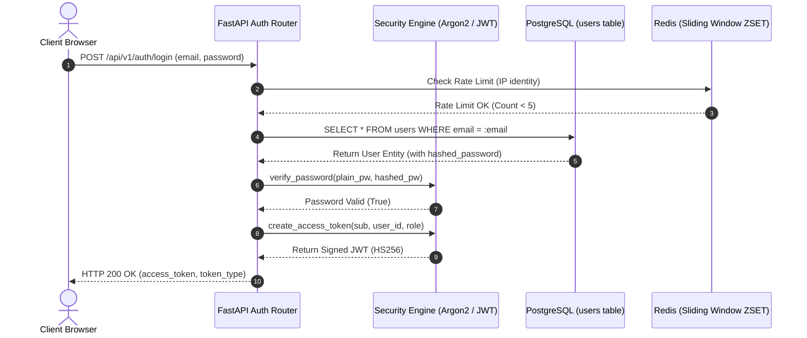
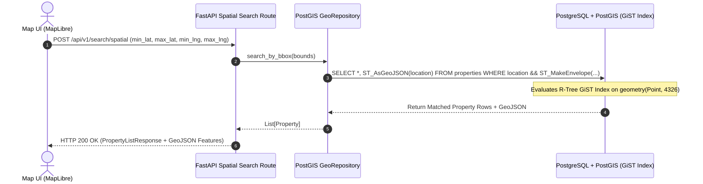
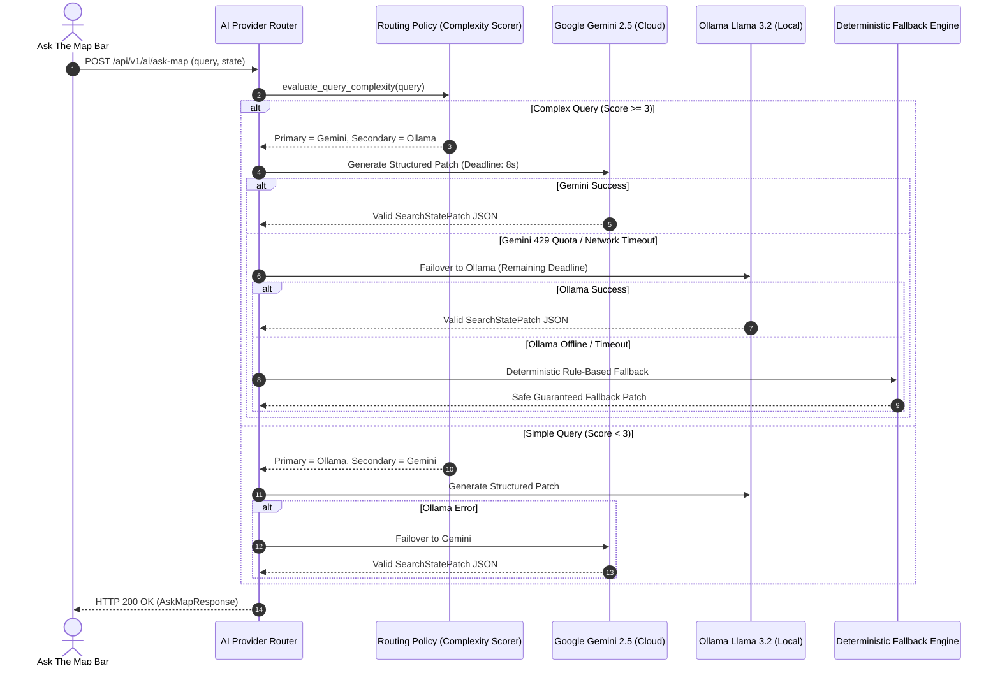

# EstateMap AI — Codebase Inventory & Request Execution Traces
> **Document Status: Authoritative Code Navigation & Request Tracing Guide**

# Part 1: Complete Codebase Inventory & Symbol Catalog

# EstateMap AI — Complete Forensic System Inventory

This document is the verified inventory of all technologies, libraries, services, configurations, and protocols in the EstateMap AI codebase. Every entry is verified against executable code, `pyproject.toml`, `package.json`, `docker-compose.yml`, and runtime configurations.

---

## 1. Backend Core & Runtime

### Python Runtime
* **Version**: `3.12.14` (Container: `python:3.12-slim`) / `3.11+` compatible.
* **Configuration**: `backend/Dockerfile`, `backend/pyproject.toml`.
* **Files Using It**: Entire `backend/app/` and `backend/tests/`.
* **Why It Exists**: High-productivity language with rich geospatial (GeoAlchemy2, Shapely) and async (asyncio, asyncpg) ecosystem.
* **What Breaks Without It**: Backend runtime ceases to exist.
* **Alternatives**: Go (faster raw concurrency, but smaller geospatial/AI SDK ecosystem), Node.js/TypeScript (unified stack, but inferior PostGIS ORM integration).
* **Choice Rationale**: Python 3.12 provides optimized async task performance, strong typing with Pydantic v2, and native integration with AI SDKs.

### FastAPI
* **Version**: `0.115.0`
* **Configuration**: `backend/pyproject.toml`, initialized in `backend/app/main.py`.
* **Files Using It**: `backend/app/api/v1/*.py`, `backend/app/core/dependencies.py`, `backend/app/core/middleware.py`.
* **Why It Exists**: High-performance asynchronous REST API framework based on ASGI standard with native Pydantic validation, dependency injection, and automatic OpenAPI generation.
* **What Breaks Without It**: All HTTP route handling, request serialization, dependency injection, and automatic Swagger documentation fail.
* **Alternatives**: Flask (synchronous by default, lacks built-in DI and modern validation), Django/DRF (heavyweight, monolithic, slower async PostGIS integration).
* **Choice Rationale**: Native `async/await` support on ASGI, declarative dependency injection graph, and compile-time OpenAPI schema generation.

### Uvicorn
* **Version**: `0.31.0` (with `standard` extras)
* **Configuration**: `backend/Dockerfile`, `docker-compose.yml`.
* **Files Using It**: Entry point for backend container command `uvicorn app.main:app --host 0.0.0.0 --port 8000 --reload`.
* **Why It Exists**: Lightning-fast ASGI server implementation using `uvloop` (libuv) and `httptools`.
* **What Breaks Without It**: ASGI application cannot receive or process incoming HTTP/TCP connections.
* **Alternatives**: Hypercorn, Gunicorn with Uvicorn workers.
* **Choice Rationale**: Industry standard for FastAPI local and containerized deployments.

### Pydantic & Pydantic-Settings
* **Version**: `pydantic 2.9.2`, `pydantic-settings 2.5.2`
* **Configuration**: `backend/pyproject.toml`, `backend/app/core/config.py`.
* **Files Using It**: All schemas in `backend/app/schemas/`, settings in `backend/app/core/config.py`.
* **Why It Exists**: Strict data validation, environment variable parsing, and JSON serialization using Rust-based core (`pydantic-core`).
* **What Breaks Without It**: Request validation fails; environment configuration fails to parse safely; typed API contracts break.
* **Alternatives**: Marshmallow, attrs, standard Python `dataclasses`.
* **Choice Rationale**: Pydantic v2 is deeply integrated into FastAPI, offering sub-millisecond serialization speeds and automatic OpenAPI schema emission.

---

## 2. Persistence, Database & Geospatial Engine

### PostgreSQL
* **Version**: `16.4` (Docker: `postgis/postgis:16-3.4`)
* **Configuration**: `docker-compose.yml`, `backend/app/core/config.py`.
* **Files Using It**: All models (`backend/app/models/`), migrations (`backend/alembic/`).
* **Why It Exists**: Enterprise-grade relational database providing ACID transactions, foreign keys, row-level integrity, and native spatial extension support.
* **What Breaks Without It**: No persistent storage for properties, users, amenities, reviews, or POIs.
* **Alternatives**: MySQL (weaker spatial capabilities), MongoDB (document store, weaker relational consistency and spatial joins).
* **Choice Rationale**: PostgreSQL is the gold standard for relational persistence and hosts PostGIS.

### PostGIS
* **Version**: `3.4` (Extension enabled on PostgreSQL 16)
* **Configuration**: `docker-compose.yml`, `backend/alembic/versions/001_initial_schema.py`.
* **Files Using It**: `backend/app/models/property.py`, `backend/app/models/poi.py`, `backend/app/repositories/geo_repository.py`.
* **Why It Exists**: Geospatial extension providing spatial types (`geometry(Point, 4326)`), R-Tree GiST indexing, and spatial calculation functions (`ST_DWithin`, `ST_DistanceSphere`, `ST_MakeEnvelope`, `ST_AsGeoJSON`).
* **What Breaks Without It**: Radius search, bounding box viewport search, and nearest POI queries cannot be executed in the database and would require full-table in-memory scans.
* **Alternatives**: SQLite SpatiaLite (limited concurrency), MySQL Spatial (less comprehensive spatial predicate library), Elasticsearch (separate sync overhead).
* **Choice Rationale**: PostGIS provides sub-millisecond spatial indexed queries on millions of coordinates with zero data replication overhead.

### SQLAlchemy (Async) & Asyncpg
* **Version**: `SQLAlchemy 2.0.35`, `asyncpg 0.29.0`
* **Configuration**: `backend/app/db/session.py`, `backend/app/core/config.py`.
* **Files Using It**: `backend/app/repositories/*.py`, `backend/app/services/*.py`, `backend/app/db/session.py`.
* **Why It Exists**: SQLAlchemy 2.0 provides typed object-relational mapping, declarative models, and async session management. `asyncpg` is the high-performance async PostgreSQL driver.
* **What Breaks Without It**: Asynchronous non-blocking database queries cannot be executed.
* **Alternatives**: Psycopg3, Tortoise ORM, Peewee.
* **Choice Rationale**: SQLAlchemy 2.0 with `asyncpg` provides the fastest async PostgreSQL throughput in Python combined with mature query building.

### GeoAlchemy2 & Shapely
* **Version**: `GeoAlchemy2 0.15.2`, `Shapely 2.0.6`
* **Configuration**: `backend/pyproject.toml`.
* **Files Using It**: `backend/app/models/property.py`, `backend/app/models/poi.py`, `backend/app/repositories/geo_repository.py`.
* **Why It Exists**: Binds SQLAlchemy to PostGIS spatial types (`Geometry('POINT', srid=4326)`) and enables spatial function compilation (`ST_SetSRID`, `ST_MakePoint`).
* **What Breaks Without It**: PostGIS geometry columns cannot be mapped to SQLAlchemy declarative models.
* **Alternatives**: Raw SQL strings without ORM type mapping.
* **Choice Rationale**: Maintains clean typed ORM mappings while preserving raw spatial SQL power.

### Alembic
* **Version**: `1.13.3`
* **Configuration**: `backend/alembic.ini`, `backend/alembic/env.py`.
* **Files Using It**: `backend/alembic/versions/*.py`.
* **Why It Exists**: Database migration tool tracking schema revisions, indexes, constraints, and spatial columns.
* **What Breaks Without It**: Schema evolution cannot be versioned or applied reproducibly across development, staging, and CI environments.
* **Alternatives**: Flyway, Liquibase, raw manual SQL scripts.
* **Choice Rationale**: Native Python migration tool deeply integrated with SQLAlchemy metadata.

---

## 3. In-Memory Cache, Rate Limiting & Distributed State

### Redis
* **Version**: `7.2-alpine` (Docker: `redis:7-alpine`)
* **Configuration**: `docker-compose.yml`, `backend/app/core/config.py`.
* **Files Using It**: `backend/app/cache/redis.py`, `backend/app/cache/cache_service.py`, `backend/app/core/rate_limit.py`.
* **Why It Exists**: High-speed in-memory data store for cache-aside storage (commute routes, location intelligence, ranking results) and sliding-window rate limiting via Redis Sorted Sets (`ZSET`).
* **What Breaks Without It**: Repeated commute routes must re-query OSRM; location intelligence queries hit PostGIS repeatedly; rate limiting degrades or operates in-process per replica.
* **Alternatives**: Memcached (lacks data structures like ZSET for sliding window), Dragonfly, KeyDB.
* **Choice Rationale**: Ubiquitous, lightweight, sub-millisecond memory latency, with atomic sorted set primitives for sliding-window rate limiting.

### redis-py (Async)
* **Version**: `redis 5.1.1` (with `aioredis` async client)
* **Configuration**: `backend/pyproject.toml`, `backend/app/cache/redis.py`.
* **Files Using It**: `backend/app/cache/cache_service.py`, `backend/app/core/rate_limit.py`.
* **Why It Exists**: Provides non-blocking `asyncio` connection pooling and async commands (`get`, `set`, `zadd`, `zremrangebyscore`, `zcard`, `expire`).
* **What Breaks Without It**: Backend would block the event loop on Redis network I/O.
* **Alternatives**: Sync redis client (would block Python async worker).
* **Choice Rationale**: Official Redis Python async client.

---

## 4. Security, Cryptography & Authentication

### Passlib & Argon2-cffi / Bcrypt
* **Version**: `passlib 1.7.4`, `argon2-cffi 23.1.0`, `bcrypt 4.2.0`
* **Configuration**: `backend/app/core/security.py`.
* **Files Using It**: `backend/app/core/security.py`, `backend/app/services/auth_service.py`.
* **Why It Exists**: Secure, salted password hashing resistant to GPU-based brute-force and dictionary attacks.
* **What Breaks Without It**: Passwords would be stored in plaintext or weak hashes, violating security fundamentals.
* **Alternatives**: PBKDF2, SHA-256 (insecure for passwords).
* **Choice Rationale**: Argon2 is the winner of the Password Hashing Competition; bcrypt serves as proven fallback.

### PyJWT & Cryptography
* **Version**: `PyJWT 2.9.0`, `cryptography 43.0.1`
* **Configuration**: `backend/app/core/security.py`.
* **Files Using It**: `backend/app/core/security.py`, `backend/app/core/dependencies.py`, `backend/app/api/v1/auth.py`.
* **Why It Exists**: Stateless authentication token issuance and cryptographic verification (HMAC-SHA256).
* **What Breaks Without It**: Users cannot maintain authenticated sessions without stateful server sessions.
* **Alternatives**: Server-side session cookies stored in Redis/PostgreSQL.
* **Choice Rationale**: Stateless, scalable across multiple API worker replicas, standard RFC 7519 format.

---

## 5. External HTTP & Routing Infrastructure

### HTTPX
* **Version**: `0.27.2`
* **Configuration**: `backend/pyproject.toml`.
* **Files Using It**: `backend/app/services/routing_service.py`, `backend/app/ai/ollama_provider.py`, `backend/tests/conftest.py`.
* **Why It Exists**: Modern, async-first HTTP client with connection pooling, timeout controls, and ASGI in-memory transport for integration tests.
* **What Breaks Without It**: Backend cannot call OSRM routing server or local Ollama instances; `pytest` ASGI integration testing breaks.
* **Alternatives**: `aiohttp`, `requests` (synchronous, blocks event loop).
* **Choice Rationale**: Clean async API, official support for ASGI client simulation (`ASGITransport`), and robust timeout handling.

### OSRM (Open Source Routing Machine) / Mock Routing Provider
* **Configuration**: `backend/app/core/config.py` (`ROUTING_PROVIDER="mock"` or `"osrm"`).
* **Files Using It**: `backend/app/services/routing_service.py`, `backend/app/services/commute_service.py`.
* **Why It Exists**: Computes realistic road-network travel distances, travel durations, and turn-by-turn GeoJSON LineString geometries across driving, transit, bicycling, and walking.
* **What Breaks Without It**: Commute times would fall back to straight-line Euclidean distances, ignoring actual road networks, rivers, and barriers.
* **Alternatives**: Google Maps Distance Matrix API (expensive, closed source), Mapbox Directions API, Valhalla, GraphHopper.
* **Choice Rationale**: Open-source, self-hostable, deterministic, zero per-query API costs.

---

## 6. AI Providers & LLM Orchestration

### Google GenAI SDK (`google-genai`)
* **Version**: `0.1.1`
* **Configuration**: `backend/app/core/config.py`, `backend/app/ai/gemini_provider.py`.
* **Files Using It**: `backend/app/ai/gemini_provider.py`.
* **Why It Exists**: Official SDK for Google Gemini 2.5 Flash / Pro models for fast structured property explanations and conversational intent parsing.
* **What Breaks Without It**: Hosted cloud AI capability is disabled (system gracefully falls back to Ollama or deterministic templates).
* **Alternatives**: OpenAI API, Anthropic Claude API, LiteLLM.
* **Choice Rationale**: Official lightweight SDK with native structured output schemas and high free-tier allowances.

### Ollama (Local LLM Provider)
* **Version**: Local runtime (`llama3.2:latest` / `qwen2.5:latest`)
* **Configuration**: `backend/app/core/config.py` (`OLLAMA_BASE_URL="http://host.docker.internal:11434"`).
* **Files Using It**: `backend/app/ai/ollama_provider.py`.
* **Why It Exists**: Zero-cost, privacy-preserving, local offline LLM inference for intent parsing and property explanations.
* **What Breaks Without It**: System requires active cloud API keys for AI features.
* **Alternatives**: Local vLLM, llama.cpp server, TGI.
* **Choice Rationale**: Standard developer desktop LLM runner with simple HTTP REST endpoints.

---

## 7. Frontend Stack & Mapping Engine

### Next.js & React
* **Version**: `Next.js 14.2.15` (App Router), `React 18.3.1`
* **Configuration**: `frontend/package.json`, `frontend/next.config.mjs`, `frontend/tsconfig.json`.
* **Files Using It**: `frontend/app/**/*.tsx`, `frontend/components/**/*.tsx`.
* **Why It Exists**: Industry standard React framework providing App Router, React Server Components (RSC), optimized client hydration, and build-time bundling.
* **What Breaks Without It**: Complete user interface fails.
* **Alternatives**: Vite + React SPA (lacks SSR/RSC optimization), Remix, SvelteKit.
* **Choice Rationale**: App Router paradigm, robust TypeScript support, wide ecosystem.

### TypeScript
* **Version**: `5.6.3`
* **Configuration**: `frontend/tsconfig.json`.
* **Files Using It**: All `.ts` and `.tsx` files in `frontend/`.
* **Why It Exists**: Static type safety preventing runtime null pointer exceptions, ensuring strict alignment between backend Pydantic schemas and frontend API responses.
* **What Breaks Without It**: Type errors go undetected until runtime; API contract drift occurs silently.
* **Alternatives**: Plain JavaScript with JSDoc.
* **Choice Rationale**: Non-negotiable standard for robust production frontend engineering.

### MapLibre GL JS & mapcn
* **Version**: `maplibre-gl 6.7.0`
* **Configuration**: `frontend/components/map/map-container.tsx`, `frontend/components/ui/map.tsx`.
* **Files Using It**: `frontend/components/map/*.tsx`.
* **Why It Exists**: High-performance WebGL-based vector map rendering engine with smooth panning, zooming, GeoJSON source clustering, and marker synchronization.
* **What Breaks Without It**: Interactive map rendering, bounding-box viewport synchronization, and route LineString overlays cannot be displayed.
* **Alternatives**: Leaflet (CPU/DOM based, lags on large GeoJSON datasets), Google Maps JavaScript API (commercial fees, proprietary), Mapbox GL JS (commercial token requirements).
* **Choice Rationale**: Open-source fork of Mapbox GL, WebGL-accelerated 60fps rendering, zero license fees.

### TanStack React Query
* **Version**: `5.59.0`
* **Configuration**: `frontend/components/providers.tsx`.
* **Files Using It**: Data fetching, caching, and background refetching across search, commute, and detail pages.
* **Why It Exists**: Declarative asynchronous state management handling caching, deduplication, loading/error states, and stale-while-revalidate cycles.
* **What Breaks Without It**: Manual `useEffect` + `useState` boilerplate required for every fetch; no automatic request deduplication or cache retention.
* **Alternatives**: SWR, Redux Toolkit Query, manual fetch wrappers.
* **Choice Rationale**: Most widely adopted async state library in the React ecosystem.

### Tailwind CSS & Lucide React
* **Version**: `tailwindcss 3.4.13`, `lucide-react 0.453.0`
* **Configuration**: `frontend/tailwind.config.ts`, `frontend/postcss.config.mjs`.
* **Files Using It**: All UI components in `frontend/components/`.
* **Why It Exists**: Utility-first styling enabling fast, responsive, dark/light theme-aware UI development with standardized icons.
* **What Breaks Without It**: UI styling and iconography break.
* **Alternatives**: Styled Components, Emotion, CSS Modules.
* **Choice Rationale**: Zero runtime CSS-in-JS overhead, standard utility classes.

---

## 8. Quality Assurance, Linting & Build Tools

### Pytest & Pytest-Asyncio
* **Version**: `pytest 8.3.3`, `pytest-asyncio 0.24.0`, `pytest-cov 5.0.0`
* **Configuration**: `backend/pyproject.toml`, `backend/tests/conftest.py`.
* **Files Using It**: All 288 test cases in `backend/tests/`.
* **Why It Exists**: Executes unit, integration, spatial, rate limiting, and contract tests with ASGI client and async fixtures.
* **What Breaks Without It**: No automated regression protection or verification of correctness.
* **Alternatives**: `unittest` (verbose, awkward async support).
* **Choice Rationale**: Python industry standard testing framework.

### Ruff
* **Version**: `ruff 0.6.9`
* **Configuration**: `backend/pyproject.toml`.
* **Files Using It**: Entire `backend/` codebase.
* **Why It Exists**: Rust-based linter and code formatter operating 10-100x faster than Flake8, Black, and isort.
* **What Breaks Without It**: Code style drift, unused imports, formatting inconsistencies.
* **Alternatives**: Black, Flake8, isort.
* **Choice Rationale**: Instantaneous linting and formatting in a single unified tool.

---

## 9. Containerization & Orchestration

### Docker & Docker Compose
* **Version**: Docker Engine 24+, Compose v2
* **Configuration**: `docker-compose.yml`, `backend/Dockerfile`, `frontend/Dockerfile`.
* **Files Using It**: Entire root repository orchestration.
* **Why It Exists**: Encapsulates PostgreSQL 16 + PostGIS 3.4, Redis 7, FastAPI Backend, and Next.js Frontend into an isolated, reproducible multi-container network.
* **What Breaks Without It**: Developer must manually install and configure PostGIS, Redis, Python 3.12, and Node 20 on their host operating system.
* **Alternatives**: Kubernetes (excessive overhead for local/single-node development), bare metal manual setup.
* **Choice Rationale**: Single-command startup (`docker compose up -d`), isolated container networking, deterministic environment reproducibility.


---

# Part 2: End-to-End Data Flows & State Lifecycles

# EstateMap AI — Architectural Data Flows

This document visualizes the complete architectural data flows across the EstateMap AI platform using Mermaid diagrams.

---

## 1. Authentication & Security Flow



---

## 2. PostGIS Spatial Bounding-Box Flow



---

## 3. Road-Network Commute & Caching Flow

```mermaid
sequenceDiagram
    autonumber
    actor User as Commute Panel
    participant CommuteAPI as FastAPI Commute Route
    participant Cache as Redis In-Memory Cache
    participant OSRM as OSRM Road Graph Engine
    participant DB as PostGIS (Fallback)

    User->>CommuteAPI: POST /api/v1/commute/route (origin, dest, mode)
    CommuteAPI->>Cache: GET estatemap:commute:v1:origin_dest:mode
    alt Cache Hit
        Cache-->>CommuteAPI: Return Cached Route JSON
    else Cache Miss
        CommuteAPI->>OSRM: HTTP GET /route/v1/{mode}/{lng1},{lat1};{lng2},{lat2}
        alt OSRM Success
            OSRM-->>CommuteAPI: Return Road Duration (s), Distance (m), GeoJSON LineString
            CommuteAPI->>Cache: SETEX key 86400 (Route JSON)
        else OSRM Timeout / Error
            CommuteAPI->>DB: Compute ST_DistanceSphere() Euclidean fallback
            DB-->>CommuteAPI: Return Spherical Distance / Average Speed
        end
    end
    CommuteAPI-->>User: HTTP 200 OK (CommuteResponse + GeoJSON Route)
```

---

## 4. Multi-Provider AI Failover Flow




---

# Part 3: Step-by-Step Request Execution Traces

# EstateMap AI — End-to-End Request Traces

This document traces critical user workflows step-by-step through the entire technical stack: Frontend -> HTTP Network -> FastAPI Router -> Middleware -> Dependency Injection -> Domain Service -> PostGIS / Redis / OSRM / LLM Provider -> Response Serialization.

---

## 1. User Authentication (Login) Trace

```
1. Frontend User Input: User enters email="user@example.com", password="SecurePassword123" on /login
2. Frontend Network: POST http://localhost:8000/api/v1/auth/login with JSON body
3. FastAPI Middleware:
   - RequestIDMiddleware generates X-Request-ID (e.g. "req_login_91a4")
   - RateLimitMiddleware checks Redis sliding window for key "estatemap:ratelimit:ip:{client_ip}:auth_login"
4. Route Handler: backend/app/api/v1/auth.py -> login(credentials: LoginRequest, db: AsyncSession)
5. Dependency Injection: get_db() yields active AsyncSession from async_session_factory()
6. Authentication Service: backend/app/services/auth_service.py -> authenticate_user()
   - Queries user by email: SELECT * FROM users WHERE email = 'user@example.com'
   - Verifies password hash using backend/app/core/security.py -> verify_password() via Argon2id
7. JWT Generation: backend/app/core/security.py -> create_access_token(data={"sub": user.email, "user_id": user.id})
   - Encodes HMAC-SHA256 signature with SECRET_KEY, exp = now + 1440 minutes
8. Response Serialization: Returns TokenResponse { access_token: "eyJ...", token_type: "bearer" }
9. Frontend Client: Stores token in localStorage and updates global authentication context.
```

---

## 2. Interactive Map Viewport Spatial Search Trace

```
1. Frontend Action: User pans/zooms map; MapLibre fires 'moveend' event.
2. Viewport Calculation: frontend/components/map/map-container.tsx extracts bounds { north: 13.08, south: 12.98, east: 80.28, west: 80.18 }.
3. User Click: User clicks "Search this area" floating button on /search.
4. Frontend Network: POST http://localhost:8000/api/v1/search/spatial
   - Request Body: { min_lat: 12.98, max_lat: 13.08, min_lng: 80.18, max_lng: 80.28, page: 1, page_size: 20 }
5. FastAPI Pipeline:
   - RequestIDMiddleware assigns X-Request-ID: "req_spatial_882b"
   - RateLimitMiddleware verifies sliding window limit.
   - Pydantic validates BoundingBoxSearchParams (checks latitude/longitude bounds).
6. Service & Repository Layer:
   - backend/app/services/geo_service.py -> search_properties_bbox()
   - backend/app/repositories/geo_repository.py executes PostGIS SQL:
     SELECT properties.*, ST_AsGeoJSON(properties.location) AS geojson
     FROM properties
     WHERE properties.location && ST_MakeEnvelope(80.18, 12.98, 80.28, 13.08, 4326)
       AND properties.status = 'active'
     ORDER BY properties.created_at DESC LIMIT 20;
7. PostGIS Kernel Execution: Evaluates spatial GiST index on properties.location using R-Tree bounding boxes.
8. Response Serialization: Maps database entities to PropertyListResponse with RFC 7946 GeoJSON features.
9. Frontend State Update: Next.js search page receives 20 properties, updates PropertyGrid, and updates MapLibre GeoJSON source markers.
```

---

## 3. Deterministic Ranked Search with Commute Route Trace

```
1. Frontend Action: User selects "Commute First" preset, chooses destination "TIDEL Park (OMR)", travel_mode="driving".
2. Frontend Network: POST http://localhost:8000/api/v1/recommendations/ranked
   - Body: {
       "filters": { "city": "Chennai", "bedrooms": 3 },
       "preferences": {
         "destination": { "name": "TIDEL Park", "latitude": 12.9897, "longitude": 80.2483 },
         "travel_mode": "driving",
         "weights": { "price": 0.15, "bedrooms": 0.15, "area": 0.10, "locality": 0.10, "location": 0.10, "commute": 0.40 }
       }
     }
3. FastAPI Pipeline: Validates RankedSearchRequest schema.
4. Ranking Service Execution: backend/app/services/ranking_service.py -> search_and_rank()
   - Step A: Filter candidate properties from PostGIS matching hard filters (city='Chennai', bedrooms=3).
   - Step B: For each candidate property (e.g. Property #103 at Lat 12.9228, Lng 80.1888):
     - Check Redis cache for commute key: `estatemap:commute:v1:p103:d12.9897_80.2483:mdriving`
     - Cache Miss: Call CommuteService -> OSRMProvider HTTP call:
       GET http://router.project-osrm.org/route/v1/driving/80.1888,12.9228;80.2483,12.9897?overview=full&geometries=geojson
     - OSRM returns: duration = 1320s (22.0 mins), distance = 14200m.
     - Store route in Redis with TTL = 86400s (24h).
   - Step C: Calculate 6 mathematical factor scores:
     - Price Score = 0.92
     - Bedrooms Score = 1.00
     - Area Score = 0.88
     - Locality Score = 0.00
     - POI Location Score = 0.80
     - Commute Score = max(0, 1 - 22.0/60) = 0.633
   - Step D: Multiply by normalized weights and sum: FinalScore = 81.42%.
5. Response: Returns RankedPropertyResponse sorted descending by final_score with exact score_breakdown.
6. Frontend Render: RankedPropertyCard displays #1 Match badge, 81.4% score pill, and expandable factor bars.
```

---

## 4. "Ask the Map" Conversational Search Trace

```
1. Frontend User Input: User types: "3 BHK under 1.5 Cr in Adyar near hospitals" in AskTheMapBar.
2. Frontend Network: POST http://localhost:8000/api/v1/ai/ask-map
   - Body: {
       "message": "3 BHK under 1.5 Cr in Adyar near hospitals",
       "session_id": "sess_9123",
       "current_state": { "city": "Chennai", "min_price": null, "max_price": null, "bedrooms": null, "preferred_poi_categories": [] }
     }
3. Orchestrator Entry: backend/app/services/search_orchestrator.py -> process_conversational_turn()
4. AI Provider Router:
   - Query complexity evaluated: Length=46, constraints=3 -> Routed to Google Gemini 2.5 Flash.
   - Dispatches structured prompt with JSON Schema enforcing SearchStatePatch.
5. LLM Structured Output:
   {
     "action": "search",
     "set_fields": { "bedrooms": 3, "max_price": 15000000, "locality": "Adyar" },
     "clear_fields": [],
     "add_poi_categories": ["hospital"],
     "remove_poi_categories": [],
     "reset_all": false,
     "assistant_message": "Filtering to 3 BHK properties in Adyar under ₹1.5 Cr with nearby hospitals.",
     "explanation_bullets": ["Set maximum price to ₹1.50 Cr", "Set bedrooms to 3", "Filtered locality to Adyar", "Added hospital access requirement"]
   }
6. State Reducer: apply_patch() updates current state -> new state: { bedrooms: 3, max_price: 15000000, locality: "Adyar", preferred_poi_categories: ["hospital"] }.
7. Direct Query Execution: Orchestrator executes PostGIS spatial/filter search with new state, returning matched properties.
8. Response Serialization: Returns AskMapResponse containing new canonical state, GeoJSON properties, and telemetry (latency=740ms, provider="gemini-2.5-flash").
9. Frontend UI Update: Map updates pins, search sidebar filters update to match new state, and AI feedback card shows exact patch badges (+ Added: hospital, ✏️ Modified: max_price).
```

