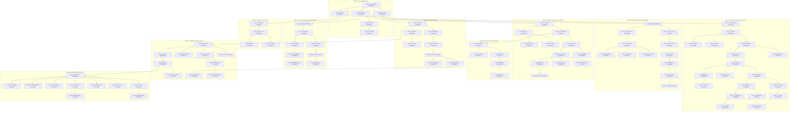

# EstateMap AI — Learning Dependency Graph
> **Directed Acyclic Graph (DAG) for all 100 Engineering Stories**

```mermaid
flowchart TD
    subgraph P1["Phase 1: Foundations (1-6)"]
        S01["Story 01: Architecture [CURRENT]"] --> S02["Story 02: Lifespan [CURRENT]"]
        S01 --> S03["Story 03: Config [CURRENT]"]
        S01 --> S04["Story 04: Schemas [CURRENT]"]
        S04 --> S05["Story 05: Errors [CURRENT]"]
        S05 --> S06["Story 06: Logging [CURRENT]"]
    end

    subgraph P2["Phase 2: Database & Spatial (7-13, 18-28)"]
        S03 --> S07["Story 07: Models [CURRENT]"]
        S07 --> S08["Story 08: Repos [CURRENT]"]
        S08 --> S09["Story 09: Asyncpg [CURRENT]"]
        S08 --> S10["Story 10: Alembic [CURRENT]"]
        S07 --> S21["Story 21: CRS Theory [THEORY]"]
        S21 --> S22["Story 22: PostGIS [CURRENT]"]
        S22 --> S23["Story 23: GiST Index [CURRENT]"]
        S23 --> S24["Story 24: Radius [CURRENT]"]
        S23 --> S25["Story 25: Viewport [CURRENT]"]
        S24 --> S26["Story 26: POIs [CURRENT]"]
        S22 --> S27["Story 27: GeoJSON [CURRENT]"]
        S23 --> S28["Story 28: Optimization [PARTIAL]"]
    end

    subgraph P3["Phase 3: Security & Auth (14-17)"]
        S03 --> S14["Story 14: Argon2id [CURRENT]"]
        S14 --> S15["Story 15: JWT Auth [CURRENT]"]
        S15 --> S16["Story 16: RBAC [CURRENT]"]
        S15 --> S17["Story 17: Security [CURRENT]"]
    end

    subgraph P4["Phase 4: Commute & Routing (29-33)"]
        S21 --> S29["Story 29: Haversine [THEORY]"]
        S29 --> S30["Story 30: Locations [PARTIAL]"]
        S29 --> S31["Story 31: Graphs [THEORY]"]
        S31 --> S32["Story 32: OSRM [CURRENT]"]
        S32 --> S33["Story 33: Matrix [CURRENT]"]
    end

    subgraph P5["Phase 5: Scoring & Comparison (34-38, 62-64)"]
        S04 --> S34["Story 34: MCDA [THEORY]"]
        S34 --> S35["Story 35: Ranking [CURRENT]"]
        S35 --> S36["Story 36: Weights [CURRENT]"]
        S36 --> S37["Story 37: Redistribution [CURRENT]"]
        S37 --> S38["Story 38: Explainability [CURRENT]"]
        S35 --> S62["Story 62: Compare [CURRENT]"]
        S62 --> S63["Story 63: Diff [CURRENT]"]
        S63 --> S64["Story 64: Summary [CURRENT]"]
    end

    subgraph P6["Phase 6: Caching & Rate Limiting (39-50)"]
        S02 --> S39["Story 39: Redis [THEORY]"]
        S39 --> S40["Story 40: Cache-Aside [CURRENT]"]
        S40 --> S41["Story 41: Key Hash [CURRENT]"]
        S41 --> S42["Story 42: Invalidation [PARTIAL]"]
        S41 --> S43["Story 43: Stampede [PARTIAL]"]
        S41 --> S44["Story 44: Route Cache [PARTIAL]"]
        S39 --> S45["Story 45: Limit Theory [THEORY]"]
        S45 --> S46["Story 46: ZSET Limiter [CURRENT]"]
        S46 --> S47["Story 47: Headers [CURRENT]"]
        S47 --> S48["Story 48: Multi-Tier [CURRENT]"]
        S48 --> S49["Story 49: Fail-Open [CURRENT]"]
        S49 --> S50["Story 50: Cluster [FUTURE]"]
    end

    subgraph P7["Phase 7: Multi-Provider AI (51-61, 65-72)"]
        S04 --> S51["Story 51: LLM Patterns [THEORY]"]
        S51 --> S52["Story 52: Protocol [CURRENT]"]
        S52 --> S53["Story 53: Ollama [CURRENT]"]
        S52 --> S54["Story 54: Gemini [CURRENT]"]
        S52 --> S55["Story 55: Validation [CURRENT]"]
        S55 --> S56["Story 56: Prompts [PARTIAL]"]
        S56 --> S57["Story 57: Routing [CURRENT]"]
        S57 --> S58["Story 58: Failover [CURRENT]"]
        S55 --> S59["Story 59: Guardrails [PARTIAL]"]
        S57 --> S60["Story 60: Tracking [PARTIAL]"]
        S58 --> S61["Story 61: Fallback [CURRENT]"]
        S57 --> S65["Story 65: AskMap [CURRENT]"]
        S65 --> S66["Story 66: Reducer [CURRENT]"]
        S66 --> S67["Story 67: Modification [CURRENT]"]
        S67 --> S68["Story 68: History [CURRENT]"]
        S67 --> S69["Story 69: Clarification [PARTIAL]"]
        S65 --> S70["Story 70: Grounding [CURRENT]"]
        S66 --> S71["Story 71: State Model [PARTIAL]"]
        S70 --> S72["Story 72: Testing [CURRENT]"]
    end

    subgraph P8["Phase 8: Frontend (73-80)"]
        S04 --> S73["Story 73: Next.js [CURRENT]"]
        S73 --> S74["Story 74: Tailwind [CURRENT]"]
        S74 --> S75["Story 75: Filters [CURRENT]"]
        S73 --> S76["Story 76: MapLibre [CURRENT]"]
        S76 --> S77["Story 77: Viewport [CURRENT]"]
        S77 --> S78["Story 78: Sync [CURRENT]"]
        S78 --> S79["Story 79: Comparison [CURRENT]"]
        S78 --> S80["Story 80: State/Query [CURRENT]"]
    end

    subgraph P9["Phase 9: Reliability & DevOps (81-90)"]
        S73 --> S81["Story 81: Compose [CURRENT]"]
        S81 --> S82["Story 82: Health [CURRENT]"]
        S81 --> S83["Story 83: Multi-Stage [PARTIAL]"]
        S81 --> S84["Story 84: Invariants [PARTIAL]"]
        S81 --> S85["Story 85: CI/CD [FUTURE]"]
        S82 --> S86["Story 86: Pytest [CURRENT]"]
        S86 --> S87["Story 87: Testcontainers [FUTURE]"]
        S80 --> S88["Story 88: Playwright [FUTURE]"]
        S82 --> S89["Story 89: Prometheus [FUTURE]"]
        S89 --> S90["Story 90: OpenTelemetry [FUTURE]"]
    end

    subgraph P10["Phase 10: System Design (91-100)"]
        S86 --> S91["Story 91: Monolith [CURRENT]"]
        S91 --> S92["Story 92: Sharding [FUTURE]"]
        S91 --> S93["Story 93: Distributed Redis [FUTURE]"]
        S91 --> S94["Story 94: AI Gateway [FUTURE]"]
        S91 --> S95["Story 95: Kafka CDC [FUTURE]"]
        S91 --> S96["Story 96: WebSockets [FUTURE]"]
        S95 --> S97["Story 97: Multi-Region [FUTURE]"]
        S91 --> S98["Story 98: Zero-Trust [FUTURE]"]
        S91 --> S99["Story 99: ADRs [CURRENT]"]
        S99 --> S100["Story 100: Whiteboard [CURRENT]"]
    end
```
