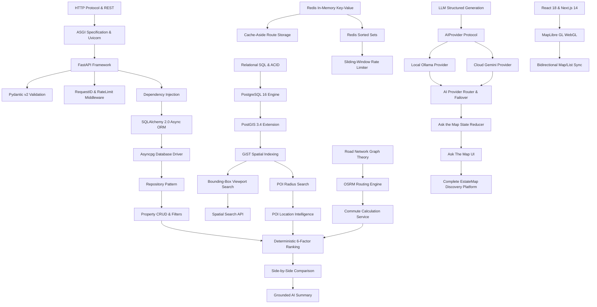

# EstateMap AI — Concept & Learning Dependency Graph

This document visualizes the prerequisite relationships between all technical concepts in the EstateMap AI platform.

---

## 1. Technical Dependency Flow

---

## 2. Learning Progression Clusters

1. **Cluster 1: Foundations**: Python 3.12, FastAPI, ASGI, Pydantic, Middleware, Error Handling.
2. **Cluster 2: Persistence & Spatial**: PostgreSQL, PostGIS, GiST, Spatial SQL (`ST_MakeEnvelope`, `ST_DWithin`), GeoJSON.
3. **Cluster 3: In-Memory Acceleration**: Redis, Cache-Aside, Key Canonicalization, Sliding-Window ZSET Rate Limiting.
4. **Cluster 4: Routing & Ranking**: OSRM road graphs, Commute matrix, 6-factor deterministic scoring, Missing-factor redistribution.
5. **Cluster 5: AI Orchestration**: Protocol abstraction, Ollama, Gemini, Query complexity routing, Deadlines, State machine delta patches.
6. **Cluster 6: Frontend & Map Sync**: Next.js App Router, MapLibre GL, WebGL viewport bounding box, Persistent Contexts.
