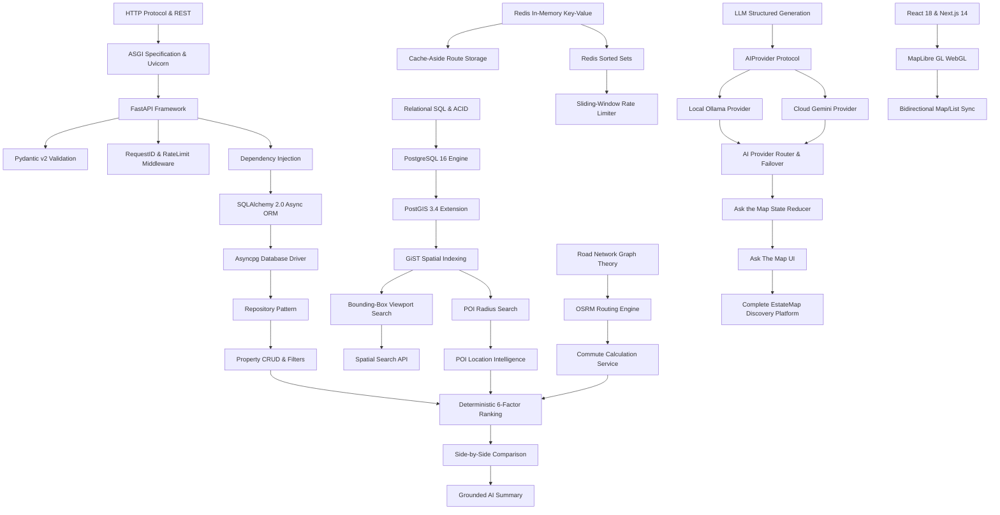

# EstateMap AI — Concept & Learning Dependency Graph
> **Visual Prerequisite Relationships, Implementation Status Markers & DAG Verification across 100 Stories**

---
## 1. Technical Dependency Flow (Core Architecture)

---
## 2. 100-Story Complete Dependency Table

### Legend:
- 🟢 `[CURRENT]` — Directly implemented in repository
- 🟡 `[PARTIAL]` — Core mechanism implemented
- 🔵 `[THEORY]` — Foundational theory / algorithm
- 🟣 `[FUTURE]` — Production scaling evolution

| Story # | Title | Points | Status | Depends On | Unlocks | Primary File Evidence |
|---|---|---|---|---|---|---|
| **Story 01** | Python Project Structure & Clean Architecture | 2 SP | 🟢 [CURRENT] | None | Story 02, Story 03, Story 04 | `backend/app/main.py` |
| **Story 02** | FastAPI Lifespan & Application Lifecycle | 3 SP | 🟢 [CURRENT] | Story 01 | Story 03, Story 06, Story 09, Story 39 | `backend/app/main.py` |
| **Story 03** | Type-Safe Configuration with Pydantic-Settings | 2 SP | 🟢 [CURRENT] | Story 01 | Story 02, Story 04, Story 07, Story 14, Story 39, Story 52 | `backend/app/core/config.py` |
| **Story 04** | API Request/Response Schemas with Pydantic v2 | 3 SP | 🟢 [CURRENT] | Story 01, Story 03 | Story 05, Story 18, Story 19, Story 27, Story 34, Story 55 | `backend/app/schemas/property.py` |
| **Story 05** | RFC 7807 Centralized Error Handling | 3 SP | 🟢 [CURRENT] | Story 01, Story 04 | Story 06, Story 14, Story 18, Story 58 | `backend/app/core/exceptions.py` |
| **Story 06** | Structured Logging & Distributed Request IDs | 3 SP | 🟢 [CURRENT] | Story 01, Story 05 | Story 13, Story 46, Story 58, Story 89 | `backend/app/core/middleware.py` |
| **Story 07** | PostgreSQL Relational Modeling & Schema Integrity | 5 SP | 🟢 [CURRENT] | Story 01, Story 03 | Story 08, Story 09, Story 10, Story 11, Story 21 | `backend/app/models/property.py` |
| **Story 08** | SQLAlchemy 2.0 Declarative Models & Repository Pattern | 5 SP | 🟢 [CURRENT] | Story 07 | Story 09, Story 18, Story 19, Story 20 | `backend/app/models/property.py` |
| **Story 09** | Non-Blocking Async Database Access with Asyncpg | 5 SP | 🟢 [CURRENT] | Story 02, Story 07, Story 08 | Story 13, Story 18, Story 86 | `backend/app/db/session.py` |
| **Story 10** | Database Migrations with Alembic | 3 SP | 🟢 [CURRENT] | Story 07, Story 08 | Story 11, Story 12, Story 81 | `backend/alembic/env.py` |
| **Story 11** | Soft Deletion & Audit Fields Pattern | 3 SP | 🟢 [CURRENT] | Story 07, Story 08, Story 10 | Story 18, Story 19 | `backend/app/models/property.py` |
| **Story 12** | Database Seeding & Deterministic Test Fixtures | 3 SP | 🟢 [CURRENT] | Story 07, Story 08, Story 10 | Story 18, Story 86 | `backend/app/db/seed_all.py` |
| **Story 13** | Connection Pooling & Pool Exhaustion Prevention | 5 SP | 🟢 [CURRENT] | Story 02, Story 06, Story 09 | Story 86, Story 92 | `backend/app/db/session.py` |
| **Story 18** | Property CRUD Domain Service & Validation Logic | 5 SP | 🟢 [CURRENT] | Story 04, Story 05, Story 08, Story 09, Story 11 | Story 19, Story 20, Story 34, Story 62 | `backend/app/services/property_service.py` |
| **Story 19** | Advanced Multi-Facet Property Filtering | 5 SP | 🟢 [CURRENT] | Story 04, Story 08, Story 18 | Story 20, Story 25, Story 34, Story 75 | `backend/app/repositories/property_repository.py` |
| **Story 20** | Deterministic Pagination & Cursor vs Offset | 5 SP | 🟢 [CURRENT] | Story 08, Story 18, Story 19 | Story 75, Story 95 | `backend/app/utils/pagination.py` |
| **Story 21** | Geospatial Fundamentals & Coordinate Reference Systems (WGS84 vs Projected) | 5 SP | 🔵 [THEORY] | Story 07 | Story 22, Story 23, Story 24, Story 29 | `backend/app/models/property.py` |
| **Story 22** | PostGIS POINT Geometry & Spatial Column Storage | 5 SP | 🟢 [CURRENT] | Story 07, Story 21 | Story 23, Story 24, Story 25 | `backend/app/models/property.py` |
| **Story 23** | GiST Spatial Indexing (Generalized Search Tree) | 8 SP | 🟢 [CURRENT] | Story 21, Story 22 | Story 24, Story 25, Story 28, Story 92 | `backend/alembic/versions/2026_09_04_0001-0001_initial_postgis.py` |
| **Story 24** | Radius Distance Search via ST_DWithin on Spheroids | 5 SP | 🟢 [CURRENT] | Story 21, Story 22, Story 23 | Story 26, Story 28, Story 35 | `backend/app/services/geo_service.py` |
| **Story 25** | Bounding-Box Viewport Search via ST_MakeEnvelope | 5 SP | 🟢 [CURRENT] | Story 21, Story 22, Story 23 | Story 28, Story 76, Story 77 | `backend/app/services/geo_service.py` |
| **Story 26** | Points of Interest (POI) Location Intelligence & Category Queries | 5 SP | 🟢 [CURRENT] | Story 22, Story 24 | Story 35, Story 38 | `backend/app/models/poi.py` |
| **Story 27** | RFC 7946 GeoJSON Standard Compliance & Serializers | 3 SP | 🟢 [CURRENT] | Story 04, Story 22 | Story 76, Story 78 | `backend/app/schemas/geo.py` |
| **Story 28** | Geospatial Query Optimization & Spatial EXPLAIN ANALYZE | 8 SP | 🟡 [PARTIAL] | Story 23, Story 24, Story 25 | Story 89, Story 92 | `backend/app/services/geo_service.py` |
| **Story 14** | Password Hashing with Argon2id & Cryptographic Salting | 3 SP | 🟢 [CURRENT] | Story 03, Story 05, Story 07 | Story 15, Story 16 | `backend/app/core/security.py` |
| **Story 15** | Stateless JWT Authentication & Cryptographic Signature Verification | 5 SP | 🟢 [CURRENT] | Story 03, Story 14 | Story 16, Story 48, Story 80 | `backend/app/core/security.py` |
| **Story 16** | Role-Based Authorization & Ownership Verification | 3 SP | 🟢 [CURRENT] | Story 14, Story 15 | Story 18, Story 98 | `backend/app/core/dependencies.py` |
| **Story 17** | Security Headers, CORS Policy & Defense-in-Depth | 3 SP | 🟢 [CURRENT] | Story 01, Story 15 | Story 81, Story 98 | `backend/app/main.py` |
| **Story 29** | Haversine Great-Circle Distance vs Geodesic Mathematics | 3 SP | 🔵 [THEORY] | Story 21 | Story 30, Story 31, Story 35 | `backend/app/utils/geo.py` |
| **Story 30** | Location Extraction & Nominatim Geocoding Integration | 5 SP | 🟡 [PARTIAL] | Story 21, Story 29 | Story 31, Story 69 | `backend/app/utils/location_resolver.py` |
| **Story 31** | Road-Network Graph Traversal vs Euclidean Spatial Distance | 5 SP | 🔵 [THEORY] | Story 21, Story 29 | Story 32, Story 33, Story 35 | `backend/app/services/commute_service.py` |
| **Story 32** | OSRM Routing Engine Integration & Table Matrix API | 5 SP | 🟢 [CURRENT] | Story 31 | Story 33, Story 44 | `backend/app/services/routing/osrm_provider.py` |
| **Story 33** | Multi-Modal Commute Matrix & Fallback Strategies | 5 SP | 🟢 [CURRENT] | Story 31, Story 32 | Story 35, Story 44 | `backend/app/services/commute_service.py` |
| **Story 34** | Multi-Criteria Decision Analysis & Scoring Normalization | 5 SP | 🔵 [THEORY] | Story 04, Story 18 | Story 35, Story 36, Story 62 | `backend/app/services/ranking_service.py` |
| **Story 35** | 6-Factor Mathematical Ranking Engine | 8 SP | 🟢 [CURRENT] | Story 24, Story 26, Story 29, Story 31, Story 33, Story 34 | Story 36, Story 37, Story 38, Story 62 | `backend/app/services/ranking_service.py` |
| **Story 36** | Weight Vector Validation & Preference Calibration | 3 SP | 🟢 [CURRENT] | Story 34, Story 35 | Story 37, Story 75 | `backend/app/schemas/ranking.py` |
| **Story 37** | Dynamic Missing-Factor Weight Redistribution | 5 SP | 🟢 [CURRENT] | Story 35, Story 36 | Story 38, Story 62 | `backend/app/services/ranking_service.py` |
| **Story 38** | Ranking Score Explainability & Score Breakdown Generation | 5 SP | 🟢 [CURRENT] | Story 26, Story 35, Story 37 | Story 64, Story 70, Story 78 | `backend/app/schemas/ranking.py` |
| **Story 62** | Deterministic Property Comparison Engine & Dimension Winners | 5 SP | 🟢 [CURRENT] | Story 18, Story 34, Story 35 | Story 63, Story 64, Story 79 | `backend/app/services/comparison_service.py` |
| **Story 63** | Quantitative Feature Comparison & Metric Diff Calculation | 3 SP | 🟢 [CURRENT] | Story 62 | Story 64, Story 79 | `backend/app/services/comparison_service.py` |
| **Story 64** | Grounded Comparison Summary Generation | 5 SP | 🟢 [CURRENT] | Story 38, Story 62, Story 63 | Story 70, Story 79 | `backend/app/services/comparison_service.py` |
| **Story 39** | Redis In-Memory Architecture & In-Memory Data Structures | 3 SP | 🔵 [THEORY] | Story 02, Story 03 | Story 40, Story 41, Story 46 | `backend/app/cache/redis.py` |
| **Story 40** | Cache-Aside (Lazy Loading) Pattern Implementation | 5 SP | 🟢 [CURRENT] | Story 39 | Story 41, Story 42, Story 43, Story 44 | `backend/app/cache/cache_service.py` |
| **Story 41** | Canonical Cache Key Design & Cryptographic Hashing | 3 SP | 🟢 [CURRENT] | Story 39, Story 40 | Story 42, Story 44 | `backend/app/cache/cache_keys.py` |
| **Story 42** | Cache Invalidation Strategies & Event-Driven Cache Eviction | 5 SP | 🟡 [PARTIAL] | Story 40, Story 41 | Story 43, Story 93 | `backend/app/cache/cache_service.py` |
| **Story 43** | Cache Stampede Mitigation & Mutex Locking / TTL Jitter | 5 SP | 🟡 [PARTIAL] | Story 40, Story 41, Story 42 | Story 93 | `backend/app/cache/cache_service.py` |
| **Story 44** | Geospatial Route Caching with Invariant Coordinate Rounding | 5 SP | 🟡 [PARTIAL] | Story 32, Story 33, Story 40, Story 41 | Story 93 | `backend/app/services/commute_service.py` |
| **Story 45** | Token Bucket vs Leaky Bucket vs Sliding Window Rate Limiting | 5 SP | 🔵 [THEORY] | Story 39 | Story 46, Story 47, Story 48 | `backend/app/core/rate_limit.py` |
| **Story 46** | Sliding-Window Log Rate Limiter via Redis Sorted Sets (ZSET) | 8 SP | 🟢 [CURRENT] | Story 06, Story 39, Story 45 | Story 47, Story 48, Story 49 | `backend/app/core/rate_limit.py` |
| **Story 47** | Rate Limit Headers (RFC 6585 & IETF Draft Standards) | 3 SP | 🟢 [CURRENT] | Story 46 | Story 48, Story 49 | `backend/app/core/middleware.py` |
| **Story 48** | Multi-Tiered Rate Limiting by Endpoint & Auth Identity | 5 SP | 🟢 [CURRENT] | Story 15, Story 46, Story 47 | Story 49, Story 94 | `backend/app/core/middleware.py` |
| **Story 49** | Fail-Open vs Fail-Closed Degradation Policies | 5 SP | 🟢 [CURRENT] | Story 46, Story 47, Story 48 | Story 50, Story 94 | `backend/app/core/rate_limit.py` |
| **Story 50** | Distributed Redis Connection Management & Sentinel High Availability | 5 SP | 🟣 [FUTURE] | Story 02, Story 39, Story 49 | Story 93, Story 97 | `backend/app/cache/redis.py` |
| **Story 51** | LLM Integration Patterns: RAG vs Function Calling vs State Machines | 5 SP | 🔵 [THEORY] | Story 04 | Story 52, Story 55, Story 65 | `backend/app/ai/base.py` |
| **Story 52** | Abstract AI Provider Protocol & Decoupled Architecture | 5 SP | 🟢 [CURRENT] | Story 03, Story 51 | Story 53, Story 54, Story 57 | `backend/app/ai/base.py` |
| **Story 53** | Local LLM Inference with Ollama (Llama 3 / Mistral) | 5 SP | 🟢 [CURRENT] | Story 52 | Story 57, Story 58 | `backend/app/ai/ollama_provider.py` |
| **Story 54** | Cloud LLM Inference with Google Gemini 1.5 Pro / Flash | 5 SP | 🟢 [CURRENT] | Story 52 | Story 57, Story 58 | `backend/app/ai/gemini_provider.py` |
| **Story 55** | Structured JSON Schema Enforcement & LLM Output Validation | 5 SP | 🟢 [CURRENT] | Story 04, Story 51, Story 52 | Story 56, Story 59, Story 66 | `backend/app/schemas/ai.py` |
| **Story 56** | Prompt Engineering for Real Estate Query Disambiguation | 5 SP | 🟡 [PARTIAL] | Story 55 | Story 57, Story 65, Story 69 | `backend/app/ai/prompts/` |
| **Story 57** | Complexity-Based AI Provider Routing Strategy | 5 SP | 🟢 [CURRENT] | Story 52, Story 53, Story 54, Story 56 | Story 58, Story 60, Story 94 | `backend/app/ai/router.py` |
| **Story 58** | Global Request Deadlines & Automatic AI Provider Failover | 8 SP | 🟢 [CURRENT] | Story 05, Story 06, Story 53, Story 54, Story 57 | Story 61, Story 94 | `backend/app/ai/router.py` |
| **Story 59** | AI Guardrails, Prompt Injection Defense & Schema Whitelisting | 5 SP | 🟡 [PARTIAL] | Story 55, Story 56 | Story 66, Story 70, Story 98 | `backend/app/ai/gemini_provider.py` |
| **Story 60** | Token Usage Tracking, Cost Estimation & Latency Metrics | 3 SP | 🟡 [PARTIAL] | Story 57, Story 58 | Story 90, Story 94 | `backend/app/ai/gemini_provider.py` |
| **Story 61** | Deterministic Fallback Parser (Zero-LLM Mode) | 5 SP | 🟢 [CURRENT] | Story 58 | Story 65, Story 66 | `backend/app/ai/mock_provider.py` |
| **Story 65** | "Ask the Map" Conversational Search Architecture | 8 SP | 🟢 [CURRENT] | Story 51, Story 56, Story 57, Story 61 | Story 66, Story 67, Story 68, Story 75 | `backend/app/api/v1/ai.py` |
| **Story 66** | Multi-Turn Conversation State Reducer & Delta Patches | 8 SP | 🟢 [CURRENT] | Story 55, Story 59, Story 61, Story 65 | Story 67, Story 68, Story 71 | `backend/app/services/search_orchestrator.py` |
| **Story 67** | Implicit vs Explicit Filter Modification in Conversational Dialogue | 5 SP | 🟢 [CURRENT] | Story 65, Story 66 | Story 68, Story 69 | `backend/app/services/search_orchestrator.py` |
| **Story 68** | Conversational Filter History & Undo/Reset State Management | 5 SP | 🟢 [CURRENT] | Story 66, Story 67 | Story 71, Story 75 | `backend/app/services/search_orchestrator.py` |
| **Story 69** | Conversational Spatial Intent Disambiguation | 5 SP | 🟡 [PARTIAL] | Story 30, Story 56, Story 65, Story 67 | Story 70, Story 77 | `backend/app/utils/location_resolver.py` |
| **Story 70** | Grounded AI Response Generation & Hallucination Prevention | 5 SP | 🟢 [CURRENT] | Story 38, Story 59, Story 64, Story 65 | Story 72, Story 75 | `backend/app/ai/gemini_provider.py` |
| **Story 71** | Conversation Session Persistence & Storage in Redis / Postgres | 5 SP | 🟡 [PARTIAL] | Story 39, Story 66, Story 68 | Story 72, Story 96 | `backend/app/cache/cache_service.py` |
| **Story 72** | End-to-End Conversational Search Integration Testing | 5 SP | 🟢 [CURRENT] | Story 65, Story 66, Story 70, Story 71 | Story 86, Story 88 | `backend/tests/integration/test_ask_the_map.py` |
| **Story 73** | Next.js 14 App Router & Server/Client Boundary Architecture | 5 SP | 🟢 [CURRENT] | Story 04 | Story 74, Story 75, Story 76 | `frontend/app/page.tsx` |
| **Story 74** | Responsive Real Estate Discovery UI with Tailwind CSS | 3 SP | 🟢 [CURRENT] | Story 73 | Story 75, Story 78, Story 79 | `frontend/app/globals.css` |
| **Story 75** | Interactive Property Search & Dynamic Filter Sidebar | 5 SP | 🟢 [CURRENT] | Story 19, Story 36, Story 73, Story 74 | Story 77, Story 78 | `frontend/components/search/filter-bar.tsx` |
| **Story 76** | MapLibre GL WebGL Vector Map Rendering & Tile Management | 5 SP | 🟢 [CURRENT] | Story 25, Story 27, Story 73 | Story 77, Story 78 | `frontend/components/map/estate-map.tsx` |
| **Story 77** | Dynamic Viewport Bounding-Box Calculation & Debounced Pan/Zoom | 5 SP | 🟢 [CURRENT] | Story 25, Story 69, Story 75, Story 76 | Story 78, Story 96 | `frontend/components/map/estate-map.tsx` |
| **Story 78** | Bidirectional Map Marker & Listing Card Synchronized Highlighting | 5 SP | 🟢 [CURRENT] | Story 27, Story 38, Story 74, Story 76, Story 77 | Story 79, Story 80 | `frontend/components/map/estate-map.tsx` |
| **Story 79** | Interactive Property Comparison Drawer & Visual Differencing | 5 SP | 🟢 [CURRENT] | Story 62, Story 63, Story 64, Story 74, Story 78 | Story 80 | `frontend/components/comparison/comparison-bar.tsx` |
| **Story 80** | Persistent Cross-Tab Favorites & Comparison Contexts | 5 SP | 🟢 [CURRENT] | Story 15, Story 78, Story 79 | Story 88 | `frontend/context/favorites-context.tsx` |
| **Story 81** | Multi-Container Docker Architecture & Networking | 5 SP | 🟢 [CURRENT] | Story 10, Story 17 | Story 82, Story 83, Story 84 | `docker-compose.yml` |
| **Story 82** | Docker Compose Health Checks & Service Dependency Orchestration | 3 SP | 🟢 [CURRENT] | Story 81 | Story 83, Story 85 | `docker-compose.yml` |
| **Story 83** | Multi-Stage Dockerfile Optimization & Minimal Distroless Containers | 5 SP | 🟡 [PARTIAL] | Story 81, Story 82 | Story 84, Story 85 | `backend/Dockerfile` |
| **Story 84** | Non-Root Security Policies & Container Hardening | 3 SP | 🟡 [PARTIAL] | Story 81, Story 83 | Story 85, Story 98 | `backend/Dockerfile` |
| **Story 85** | Continuous Integration Pipeline with GitHub Actions | 5 SP | 🟣 [FUTURE] | Story 82, Story 83, Story 84 | Story 86, Story 88 | `Hypothetical CI Architecture — NOT CURRENTLY PRESENT in repository root` |
| **Story 86** | Comprehensive Test Pyramid & Async Testing Fixtures | 8 SP | 🟢 [CURRENT] | Story 09, Story 12, Story 72, Story 85 | Story 87, Story 88 | `backend/tests/conftest.py` |
| **Story 87** | Integration Testing with Testcontainers & Isolated Postgres/Redis | 5 SP | 🟣 [FUTURE] | Story 86 | Story 88, Story 92 | `Hypothetical Testcontainers Architecture — NOT CURRENTLY PRESENT (Uses Docker Compose environment)` |
| **Story 88** | Frontend End-to-End Testing with Playwright & Mock Service Worker | 5 SP | 🟣 [FUTURE] | Story 80, Story 85, Story 86 | Story 96 | `frontend/__tests__/` |
| **Story 89** | Application Performance Monitoring & OpenTelemetry Tracing | 5 SP | 🟣 [FUTURE] | Story 06, Story 28 | Story 90, Story 96 | `backend/app/core/logging.py` |
| **Story 90** | Prometheus Metrics & Grafana Dashboard Observability | 5 SP | 🟣 [FUTURE] | Story 60, Story 89 | Story 96 | `Hypothetical Prometheus/Grafana Configuration — NOT CURRENTLY PRESENT` |
| **Story 91** | Defense of the Modular Monolith Architecture | 8 SP | 🟢 [CURRENT] | Story 01, Story 81 | Story 92, Story 93, Story 99, Story 100 | `backend/app/main.py` |
| **Story 92** | Database Scaling: Read Replicas, Connection Pooling & Sharding | 8 SP | 🟣 [FUTURE] | Story 13, Story 23, Story 28, Story 87 | Story 93, Story 95, Story 97, Story 100 | `backend/app/db/session.py` |
| **Story 93** | Caching Architecture at Scale: Distributed Redis Cluster & Invalidation | 8 SP | 🟣 [FUTURE] | Story 42, Story 43, Story 44, Story 50 | Story 95, Story 96, Story 97, Story 100 | `backend/app/cache/cache_service.py` |
| **Story 94** | AI Gateway Architecture: Rate Limiting, Cost Optimization & Model Routing | 8 SP | 🟣 [FUTURE] | Story 48, Story 49, Story 57, Story 58, Story 60 | Story 96, Story 100 | `backend/app/ai/router.py` |
| **Story 95** | High-Throughput Ingestion Pipeline for Real Estate Listings | 8 SP | 🟣 [FUTURE] | Story 20, Story 92, Story 93 | Story 96, Story 97, Story 100 | `backend/app/services/property_service.py` |
| **Story 96** | Real-Time Viewport Sync at 100k Concurrent Users | 8 SP | 🟣 [FUTURE] | Story 71, Story 77, Story 88, Story 89, Story 90 | Story 97, Story 100 | `backend/app/services/geo_service.py` |
| **Story 97** | Disaster Recovery, Multi-Region Availability & Data Replication | 8 SP | 🟣 [FUTURE] | Story 50, Story 92, Story 93, Story 95 | Story 98, Story 100 | `Hypothetical Multi-Region Disaster Recovery Architecture — NOT CURRENTLY PRESENT` |
| **Story 98** | Security Architecture: Zero-Trust, Secret Rotation & Data Protection | 8 SP | 🟣 [FUTURE] | Story 16, Story 17, Story 59, Story 84 | Story 99, Story 100 | `backend/app/core/security.py` |
| **Story 99** | Engineering Tradeoff Audit: 10 Decisions We Defend and 5 We Would Change | 8 SP | 🟢 [CURRENT] | Story 91, Story 98 | Story 100 | `docs/mastery/TRADEOFF_MATRIX.md` |
| **Story 100** | Complete EstateMap System Design Whiteboard Defense | 13 SP | 🟢 [CURRENT] | Story 91, Story 92, Story 93, Story 94, Story 95, Story 96, Story 97, Story 98, Story 99 | None | `docs/mastery/ESTATEMAP_MASTER_BOOK.md` |