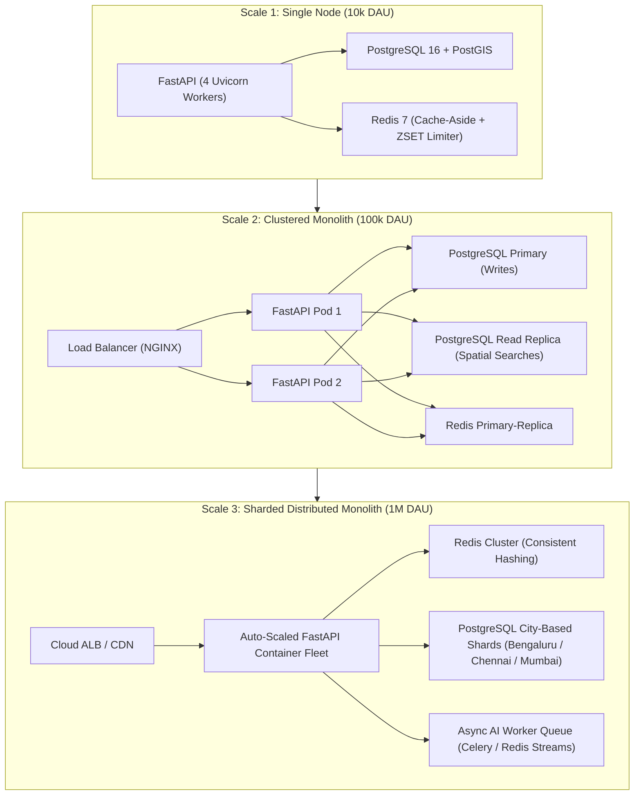

# EstateMap AI — Requirement-Driven System Design, Tradeoffs & Scalability Case Study
> **Document Status: Authoritative System Design Case Study & Interview Defense Guide**

---

## 1. System Requirements & Functional Scope

### Functional Requirements
1. **Multi-Modal Geospatial Discovery:** Query listings via bounding-box viewports, radius buffers, and administrative localities.
2. **Deterministic Multi-Criteria Ranking:** Rank properties across price, space, locality, proximity, and commute duration.
3. **Conversational Natural Language Search:** Parse unstructured search intents, maintain multi-turn filter state, and resolve landmarks.
4. **Side-by-Side Property Comparison:** Calculate quantitative metric differences and determine dimensional winners.
5. **Multi-Provider AI Resilience:** Dynamic LLM routing with sub-5s timeouts and deterministic fallback generation.

### Non-Functional Requirements & Latency SLOs
* **p50 Latency:** < 20ms for cached viewport queries; < 50ms for PostGIS spatial searches.
* **p95 Latency:** < 100ms for full 6-factor ranking pipeline.
* **Availability:** 99.9% uptime (guaranteed by graceful Redis fail-open and AI algorithmic fallbacks).
* **Data Integrity:** Strict ACID transactional consistency for property records and user ownership.

---

## 2. 15 Core Architectural Tradeoffs

| # | Decision | Chosen Approach | Rejected Alternative | Engineering Rationale |
| :-: | :--- | :--- | :--- | :--- |
| **1** | Architecture Pattern | **Modular Monolith** | Microservices | Eliminates network RPC overhead, distributed tracing complexity, and two-phase commits for a single-team codebase. |
| **2** | Spatial Database | **PostgreSQL + PostGIS** | Elasticsearch Geo | PostGIS provides native spatial joins, GiST R-Tree indexing, and strict ACID consistency in the primary database. |
| **3** | Database Driver | **Asyncpg + SQLAlchemy 2.0** | Psycopg2 Synchronous | Non-blocking async driver prevents thread pool starvation on the Python asyncio event loop. |
| **4** | Map Engine API | **MapLibre GL JS (GeoJSON)** | Raster Map Tiles | Client-side vector rendering allows instant property highlighting and bounding box queries without tile server infrastructure. |
| **5** | In-Memory Cache | **Redis Cache-Aside** | In-Memory Python Dict | Redis provides shared, process-independent caching across multiple horizontally scaled ASGI workers. |
| **6** | Cache Invalidation | **Non-Blocking SCAN** | Blocking KEYS * | KEYS * blocks the single-threaded Redis event loop for seconds; SCAN iterates cursor-by-cursor safely. |
| **7** | Rate Limiting | **Sliding Window Log (ZSET)** | Fixed Window Counter | ZSET sliding window eliminates the 2x traffic burst vulnerability across window boundaries. |
| **8** | Rate Limit Resilience | **Fail-Open Policy** | Fail-Closed Policy | Prioritizes application availability over strict rate enforcement if Redis experiences downtime. |
| **9** | Ranking Architecture | **Deterministic MCDA Engine** | LLM Neural Ranking | Deterministic ranking is sub-5ms, 100% reproducible, cost-free, and mathematically immune to hallucinations. |
| **10** | Missing-Factor Math | **Dynamic Weight Renormalization** | Fixed Zero Penalty | Dividing active weights by active_weight_sum preserves relative priority ratios when optional criteria are omitted. |
| **11** | AI Integration | **Abstract Provider Protocol** | Vendor SDK Direct Calls | Protocol abstraction enables swappable local Ollama and cloud Gemini execution without vendor lock-in. |
| **12** | AI Resilience | **Multi-Tier Circuit Failover** | Single Provider | Primary provider timeouts (5s) automatically failover to backup provider and algorithmic fallback. |
| **13** | Conversational State | **Stateless State Reducer** | Server-Side Redis Sessions | Client-held state allows any backend worker replica to handle any turn without sticky sessions. |
| **14** | Password Hashing | **Argon2id Memory-Hard** | SHA-256 / MD5 | Argon2id is memory-hard and computationally expensive, defeating GPU/ASIC rainbow table attacks. |
| **15** | Token Architecture | **Stateless JWT (HS256)** | State Session IDs | Stateless tokens allow backend API instances to verify signatures locally without database lookups. |

---

## 3. Technology Necessity Matrix

| Component | Technology | Why It Is Strictly Necessary | What Breaks If Swapped Trivially |
| :--- | :--- | :--- | :--- |
| **Web Gateway** | FastAPI (Python 3.12) | High-throughput ASGI event loop with native Pydantic v2 validation. | Flask/Django WSGI would block event loops during async I/O. |
| **Database** | PostgreSQL 16 + PostGIS | Enterprise spatial indexing (GiST) and geodesic distance math. | MySQL spatial lacks advanced geodesic functions; Mongo lacks strict relational constraints. |
| **Cache & Limiter** | Redis 7 | Sub-millisecond in-memory data structures (ZSET, string key-value). | In-process cache cannot share state across horizontal backend workers. |
| **Routing** | OSRM Engine | Real road-network driving distance and duration calculations. | Straight-line distance ignores physical road geometry and water bodies. |
| **AI LLM** | Ollama (Local) + Gemini (Cloud) | Flexible, cost-optimized conversational intent parsing and grounded summaries. | Single-provider architecture creates total dependency on external API availability. |

---

## 4. Failure Modes & Resiliency Mitigations

| Failure Mode | Direct Symptom | Root Cause | Built-in Mitigation |
| :--- | :--- | :--- | :--- |
| **Redis Outage** | Cache misses, rate limiter calls fail | Redis container crashes or network partitions | `CacheService` falls back to DB; `RateLimiter` fails open (`RATE_LIMIT_FAIL_OPEN=True`). |
| **OSRM Routing Timeout** | Commute endpoint hangs | Public OSRM demo server high traffic | 5.0s async timeout catches error; `CommuteService` executes Haversine velocity fallback. |
| **AI Provider Timeout / 429** | Natural language search stalls | LLM inference latency or rate quota exceeded | 5.0s `asyncio.wait_for` triggers `AIRouter` failover from Ollama to Gemini to Algorithmic Fallback. |
| **DB Connection Pool Saturation** | HTTP 500 / Timeout on DB queries | Slow queries holding open pool connections | `pool_size=20, max_overflow=10, pool_pre_ping=True` + GiST index optimizations. |
| **Invalid Spatial Coordinates** | PostGIS query returns empty / error | Latitude/Longitude coordinates swapped | Pydantic validation bounds `lat [-90, 90]` and `lon [-180, 180]` at the API boundary. |

---

## 5. Requirement-Driven Scalability Evolution (10k → 1M Users)

### Scaling Milestones & Triggers
1. **10k DAU (Current Baseline):** Single PostgreSQL node with GiST indexes + single Redis instance handles all traffic with p95 < 50ms.
2. **100k DAU (Read Replica Trigger):** When database read CPU exceeds 70%, deploy PostgreSQL read replicas for `GET /api/v1/properties/map` and search queries; route mutations (`POST/PUT/DELETE`) to primary.
3. **1M DAU (Spatial Sharding Trigger):** When listing count exceeds 10 million rows, partition PostgreSQL tables by City (`Bengaluru`, `Chennai`, `Hyderabad`) using PostgreSQL declarative partition tables or Citus spatial sharding.
